# home-generative-agent

[![GitHub Release][releases-shield]][releases]
[![GitHub Activity][commits-shield]][commits]
[![License][license-shield]](LICENSE)

![Project Maintenance][maintenance-shield]

This README is the documentation for a [Home Assistant](https://www.home-assistant.io/) (HA) integration called home-generative-agent. This project uses [LangChain](https://www.langchain.com/) and [LangGraph](https://www.langchain.com/langgraph) to create a [generative AI agent](https://arxiv.org/abs/2304.03442#) that interacts with and automates tasks within a HA smart home environment. The agent understands your home's context, learns your preferences, and interacts with you and your home to accomplish activities you find valuable. Key features include creating automations, analyzing images, and managing home states using various LLMs (Large Language Models). The architecture involves both cloud-based and edge-based models for optimal performance and cost-effectiveness. Installation instructions, configuration details, and information on the project's architecture and the different models used are included. The project is open-source and welcomes contributions.

These are some of the features currently supported:

- Create complex Home Assistant automations.
- Image scene analysis and understanding.
- Home state analysis of entities, devices, and areas.
- Full agent control of allowed entities in the home.
- Short- and long-term memory using semantic search.
- Automatic summarization of home state to manage LLM context length.

This integration will set up the `conversation` platform, allowing users to converse directly with the Home Generative Assistant, and the `image` and `sensor` platforms which create entities to display the latest camera image, the AI-generated summary, and recognized people in HA's UI or they can be used to create automations.

## Installation

### HACS


1. Install the [PostgreSQL with pgvector](https://github.com/goruck/addon-postgres-pgvector/tree/main/postgres_pgvector) add-on by clicking the button below and configure it according to [these directions](https://github.com/goruck/addon-postgres-pgvector/blob/main/postgres_pgvector/DOCS.md). This allows for persistence storage of conversations and memories with vector similarity search.

[](https://my.home-assistant.io/redirect/supervisor_add_addon_repository/?repository_url=https%3A%2F%2Fgithub.com%2Fgoruck%2Faddon-postgres-pgvector)

2. home-generative-agent is available in the default HACS repository. You can install it directly through HACS or click the button below to open it there.

[](https://my.home-assistant.io/redirect/hacs_repository/?owner=goruck&repository=https%3A%2F%2Fgithub.com%2Fgoruck%2Fhome-generative-agent&category=integration)

3. Add Home Generative Agent as an assistant in your Home Assistant installation by going to Settings → Voice Assistants. Use a configuration similar to the figure below.

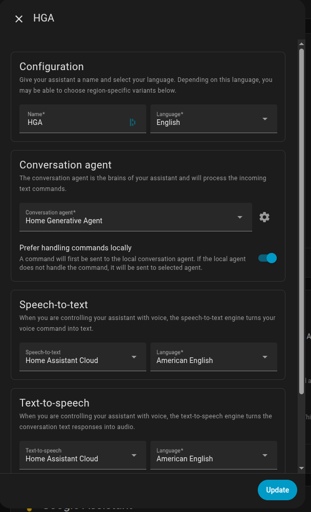

4. Install all the Blueprints in the `blueprints` directory. You can manually create automations using these that converse directly with the Agent (the Agent can also create automations for you from your your conversations with it, see examples below.)

5. (Optional) Install `ollama` on your edge device by following the instructions [here](https://ollama.com/download).

- Pull `ollama` models `gpt-oss`, `qwen3:8b`, `qwen3:1.7b`, `qwen2.5vl:7b` and `mxbai-embed-large`.

6. (Optional) Install [face-service](https://github.com/goruck/face-service) on your edge device if you want to use face recognition.

- Go to Developers tools -> Actions -> Enroll Person in the HA UI to enroll a new person into the face database from an image file.

### Manual (non-HACS install)
1. Install PostgreSQL with pgvector as shown above in Step 1.
2. Using the tool of choice, open your HA configuration's directory (where you find `configuration.yaml`).
3. If you do not have a `custom_components` directory, you must create it.
4. In the `custom_components` directory, create a new sub-directory called `home_generative_agent`.
5. Download _all_ the files from the `custom_components/home_generative_agent/` directory in this repository.
6. Place the files you downloaded in the new directory you created.
7. Restart Home Assistant
8. In the HA UI, go to "Configuration" -> "Integrations" click "+," and search for "Home Generative Agent"
9. Follow steps 3 to 6 above.

## Configuration
Configuration is done entirely in the Home Assistant UI using subentry flows.
A "feature" is a discrete capability exposed by the integration (for example Conversation, Camera Image Analysis, or Conversation Summarization). Each feature is enabled separately and has its own model/provider configuration.

1. Add the integration (instruction-only screen).
   - If you previously configured the integration via the legacy flow, your settings are automatically migrated into the new subentry-based UI.
2. Click **+ Setup** on the integration page.
   - Enable optional features.
   - Configure each enabled feature’s model settings.
   - Configure the database.
   - If no model provider exists, you’ll see a reminder to add one.
   - Default features include Conversation, Camera Image Analysis, and Conversation Summarization.
3. Click **+ Model Provider** to add a provider (Edge/Cloud → provider → settings).
   - The first provider is automatically assigned to all features with default models.
4. Use a feature’s gear icon to adjust that feature’s model settings later.

Embedding model selection: the integration uses the first model provider that supports embeddings (or the feature’s provider when it advertises embedding capability). If you want a different embedding model, add a provider that supports embeddings and select the desired embedding model name in that provider’s defaults, then re-run Setup or reload the integration.

If you want separate Ollama servers per feature, add multiple Model Provider subentries and assign them in each feature’s settings. For example: create a “Primary Ollama” provider pointing at your chat server and a “Vision Ollama” provider pointing at your camera analysis server, then select the appropriate provider on the feature’s model settings step.

Global options (prompt, face recognition URL, context management, critical-action PIN, etc.) live in the integration’s **Options** flow.

### Schema-first YAML mode

**Schema-first JSON for YAML requests** controls how the agent handles YAML-style requests (automations, dashboards, or “show me YAML”).

When it is **ON**:
- The agent returns strict JSON that the integration converts to YAML for display.
- Automations are not auto-registered; the YAML is shown in chat.
- If you want a file you can use in Home Assistant, explicitly ask the agent to **save the YAML**. It writes under `/config/www/` and returns a `/local/...` URL.

When it is **OFF**:
- Dashboard generation is disabled; the agent will respond: “Please enable 'Schema-first JSON for YAML requests' in HGA's configuration and try again.”
- Automations are auto-registered; the YAML is not shown in chat.
- Other YAML-style requests follow the standard prompt behavior (no schema enforcement).

Note: the YAML rendered in the chat window may not preserve indentation due to UI rendering, so it may be invalid if copied directly. Use the saved file instead.

Example prompt: “Save this YAML to a file called garage-light.”

### Critical Action PIN protection

Keep unlocking and opening actions behind a second check. Open Home Assistant → Settings → Devices & Services → Home Generative Agent → Configure and toggle `Require critical action PIN` (on by default). Enter a 4-10 digit PIN to set or replace it; the value is stored as a salted hash. Leaving the field blank while the toggle is on clears the stored PIN, and turning the toggle off removes the guard entirely. In the conversation agent settings for HGA, disable `Prefer handling commands locally` for Critical Action PIN protection to work properly.

The agent will demand the PIN before it:
- Unlocks or opens locks.
- Opens covers whose entity_id includes door/gate/garage, or opens garage doors.
- Uses HA intent tools on locks. Alarm control panels use their own alarm code and never the PIN.

If you have an alarm control panel, the agent will ask for that alarm's code when arming or disarming; this code is separate from the critical-action PIN.

When you ask the agent to perform a protected action, it queues the request and asks for the PIN. Reply with the digits to complete the action; after five bad attempts or 10 minutes, the queued action expires and you must ask again. If the guard is enabled but no PIN is configured, the agent will reject the request until you set one in options.

## Image and Sensor Entities

This section shows how to display the latest camera image, the AI-generated summary, and recognized people in Home Assistant or use in automations via the image and sensor platforms.

### Overview
 
   * Image entities (1 per camera): `image.<camera_slug>_last_event`. Shows the most recent snapshot published by the analyzer/service.

   * Sensor entities (1 per camera): `sensor.<camera_slug>_recognized_people`
   
   * Attributes include:
      * recognized_people: names from face recognition
      * summary: AI description of the last frame
      * latest_path: filesystem path of the published image
      * count, last_event, camera_id: aux info

The analyzer publishes snapshots automatically on motion/recording, and you can also invoke a service to capture and analyze now. For this to work, HA needs to have write access to your snapshots location (default: `/media/snapshots`) and your camera entities must exist in HA (`camera.*`).

In the examples below, replace the entity names with the actuals from your HA installation.

### Publish a Latest Event (On Demand)

A service is provided to capture a fresh snapshot, analyze it, and publish it as the latest event.

- Service: `home_generative_agent.save_and_analyze_snapshot`
   - target: one or more camera.* entities
   - fields:
      - protect_minutes (optional, default: 30) — protect the new file from pruning

Example -> Developer Tools -> Services:

```yaml
service: home_generative_agent.save_and_analyze_snapshot
target:
  entity_id:
    - camera.frontgate
    - camera.backyard
data:
  protect_minutes: 30
```

Example Button Card in UI:

```yaml
type: button
name: Refresh Frontgate
icon: mdi:camera
tap_action:
  action: call-service
  service: home_generative_agent.save_and_analyze_snapshot
  target:
    entity_id: camera.frontgate
```

### Dashboards (Lovelace) — Show Image + Summary + Names

* Simple Image and Markdown (two cards per camera)

```yaml
type: grid
columns: 2
square: false
cards:
  - type: vertical-stack
    cards:
      - type: picture-entity
        entity: image.frontgate_last_event
        show_name: false
        show_state: false
      - type: markdown
        content: |
          **Summary**
          {{ state_attr('image.frontgate_last_event', 'summary') or '—' }}

          **Recognized**
          
          {{ names | join(', ') if names else 'None' }}
```

Duplicate the stack for each camera’s `image.<slug>_last_event`.

* All in one cameras view

```yaml
title: Cameras
path: cameras
cards:
  - type: grid
    columns: 2
    square: false
    cards:
      # Repeat this block for each camera slug
      - type: vertical-stack
        cards:
          - type: picture-entity
            entity: image.frontgate_last_event
            show_name: false
            show_state: false
          - type: markdown
            content: |
              **Summary**
              {{ state_attr('image.frontgate_last_event', 'summary') or '—' }}

              **Recognized**
              
              {{ names | join(', ') if names else 'None' }}
```

* Overlay: Place Text on the Image

```yaml
type: picture-elements
image: /api/image_proxy/image.frontgate_last_event
elements:
  - type: markdown
    content: >
      
      **{{ names | join(', ') if names else 'None' }}**
    style:
      top: 6%
      left: 50%
      width: 92%
      color: white
      text-shadow: 0 0 6px rgba(0,0,0,0.9)
      transform: translateX(-50%)
  - type: state-label
    entity: image.frontgate_last_event
    attribute: summary
    style:
      bottom: 6%
      left: 50%
      width: 92%
      color: white
      text-shadow: 0 0 6px rgba(0,0,0,0.9)
      transform: translateX(-50%)
```

### Automations

Notify when people are recognized on any camera:

```yaml
alias: Camera recognized people
mode: parallel
trigger:
  - platform: state
    entity_id:
      - sensor.frontgate_recognized_people
      - sensor.playroomdoor_recognized_people
      - sensor.backyard_recognized_people
condition: []
action:
  - variables:
      ent: "{{ trigger.entity_id }}"
      cam: "{{ state_attr(ent, 'camera_id') }}"
      names: "{{ state_attr(ent, 'recognized_people') or [] }}"
      summary: "{{ state_attr(ent, 'summary') or 'An event occurred.' }}"
      image_entity: "image.{{ cam.split('.')[-1] }}_last_event"
  - service: notify.mobile_app_phone
    data:
      title: "Camera: {{ cam }}"
      message: >
        {{ summary }}
         Recognized: {{ names | join(', ') }}.
      data:
        image: >
          {{ state_attr(image_entity, 'entity_picture') }}
```

### Events and Signals

* Event `hga_last_event_frame` is fired whenever a new “latest” frame is published.

```json
{
  "camera_id": "camera.frontgate",
  "summary": "A person approaches the gate...",
  "path": "/media/snapshots/camera_frontgate/snapshot_YYYYMMDD_HHMMSS.jpg",
  "latest": "/media/snapshots/camera_frontgate/_latest/latest.jpg"
}
```

* Dispatcher signals (internal):

  * `SIGNAL_HGA_NEW_LATEST` -> updates image.*_last_event

  * `SIGNAL_HGA_RECOGNIZED` -> updates sensor.*_recognized_people

Most users won’t need to consume these directly; the platform entities update automatically.

## Architecture and Design

Below is a high-level view of the architecture.

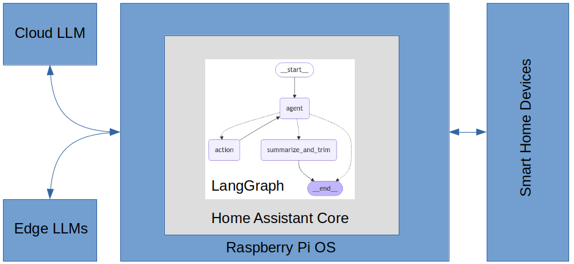

The general integration architecture follows the best practices as described in [Home Assistant Core](https://developers.home-assistant.io/docs/development_index/) and is compliant with [Home Assistant Community Store](https://www.hacs.xyz/) (HACS) publishing requirements.

The agent is built using LangGraph and uses the HA `conversation` component to interact with the user. The agent uses the Home Assistant LLM API to fetch the state of the home and understand the HA native tools it has at its disposal. I implemented all other tools available to the agent using LangChain. The agent employs several LLMs, a large and very accurate primary model for high-level reasoning, smaller specialized helper models for camera image analysis, primary model context summarization, and embedding generation for long-term semantic search. The models can be either cloud (best accuracy, highest cost) or edge-based (good accuracy, lowest cost). The edge models run under the [Ollama](https://ollama.com/) framework on a computer located in the home. Recommended defaults and supported models are configurable in the integration UI, with defaults defined in `const.py`.

Category | Provider | Default model | Purpose
-- | -- | -- | -- |
Chat | OpenAI | gpt-5 | High-level reasoning and planning
Chat | Ollama | gpt-oss | High-level reasoning and planning
Chat | Gemini | gemini-2.5-flash-lite | High-level reasoning and planning
VLM | Ollama | qwen3-vl:8b | Image scene analysis
VLM | OpenAI | gpt-5-nano | Image scene analysis
VLM | Gemini | gemini-2.5-flash-lite | Image scene analysis
Summarization | Ollama | qwen3:1.7b | Primary model context summarization
Summarization | OpenAI | gpt-5-nano | Primary model context summarization
Summarization | Gemini | gemini-2.5-flash-lite | Primary model context summarization
Embeddings | Ollama | mxbai-embed-large | Embedding generation for semantic search
Embeddings | OpenAI | text-embedding-3-small | Embedding generation for semantic search
Embeddings | Gemini | gemini-embedding-001 | Embedding generation for semantic search

### LangGraph-based Agent
LangGraph powers the conversation agent, enabling you to create stateful, multi-actor applications utilizing LLMs as quickly as possible. It extends LangChain's capabilities, introducing the ability to create and manage cyclical graphs essential for developing complex agent runtimes. A graph models the agent workflow, as seen in the image below.

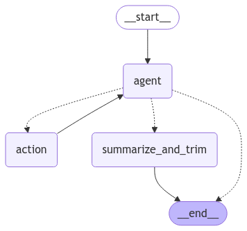

The agent workflow has three nodes, each Python module modifying the agent's state, a shared data structure. The edges between the nodes represent the allowed transitions between them, with solid lines unconditional and dashed lines conditional. Nodes do the work, and edges tell what to do next.

The ```__start__``` and ```__end__``` nodes inform the graph where to start and stop. The ```agent``` node runs the primary LLM, and if it decides to use a tool, the ```action``` node runs the tool and then returns control to the ```agent```. When the agent does not call a tool, control passes to ```summarize_and_remove_messages```, which summarizes only when trimming is required to manage the LLM context.

### LLM Context Management
You need to carefully manage the context length of LLMs to balance cost, accuracy, and latency and avoid triggering rate limits such as OpenAI's Tokens per Minute restriction. The system controls the context length of the primary model by trimming the messages in the context if they exceed a max parameter which can be expressed in either tokens or messages, and the trimmed messages are replaced by a shorter summary inserted into the system message. These parameters are configurable in the UI, with defaults defined in `const.py`; their description is below.

Parameter | Description | Default
-- | -- | -- |
`max_messages_in_context` | Messages to keep in context before deletion | 60
`max_tokens_in_context` | Tokens to keep in context before deletion | 32000
`manage_context_with_tokens` | If "true", use tokens to manage context, else use messages | "true"

### Latency
The latency between user requests or the agent taking timely action on the user's behalf is critical for you to consider in the design. I used several techniques to reduce latency, including using specialized, smaller helper LLMs running on the edge and facilitating primary model prompt caching by structuring the prompts to put static content, such as instructions and examples, upfront and variable content, such as user-specific information at the end. These techniques also reduce primary model usage costs considerably.

You can see the typical latency performance in the table below.

Action | Latency (s) | Remark
-- | -- | -- |
HA intents | < 1 | e.g., turn on a light
Analyze camera image | < 3 | initial request
Add automation | < 1 |
Memory operations | < 1 |

### Tools
The agent can use HA tools as specified in the [LLM API](https://developers.home-assistant.io/docs/core/llm/) and other tools built in the LangChain framework as defined in `tools.py`. Additionally, you can extend the LLM API with tools of your own as well. The code gives the primary LLM the list of tools it can call, along with instructions on using them in its system message and in the docstring of the tool's Python function definition. If the agent decides to use a tool, the LangGraph node `action` is entered, and the node's code runs the tool. The node uses a simple error recovery mechanism that will ask the agent to try calling the tool again with corrected parameters in the event of making a mistake.

The agent can call HA LLM API tools, including [built-in intents](https://developers.home-assistant.io/docs/intent_builtin) like `HassTurnOn` and `HassTurnOff`. The integration normalizes lock intents to lock/unlock services and routes alarm intents to the `alarm_control` tool.

You can see the list of LangChain tools that the agent can use in the table below.

Langchain Tool | Purpose
-- | -- |
`get_and_analyze_camera_image` | run scene analysis on the image from a camera
`upsert_memory` | add or update a memory
`add_automation` | create and register a HA automation
`write_yaml_file` | write YAML to `/config/www/` and return a `/local/...` URL
`confirm_sensitive_action` | confirm and execute a pending critical action with a PIN
`alarm_control` | arm or disarm an alarm control panel with the alarm code
`get_entity_history` | query HA database for entity history
<del>`get_current_device_state`</del> | <del>get the current state of one or more Home Assistant devices</del> (deprecated, using native HA GetLiveContext tool instead)

### Hardware
I built the HA installation on a Raspberry Pi 5 with SSD storage, Zigbee, and LAN connectivity. I deployed the edge models under Ollama on an Ubuntu-based server with an AMD 64-bit 3.4 GHz CPU, Nvidia 3090 GPU, and 64 GB system RAM. The server is on the same LAN as the Raspberry Pi.

## Example Use Cases
### Create an automation.
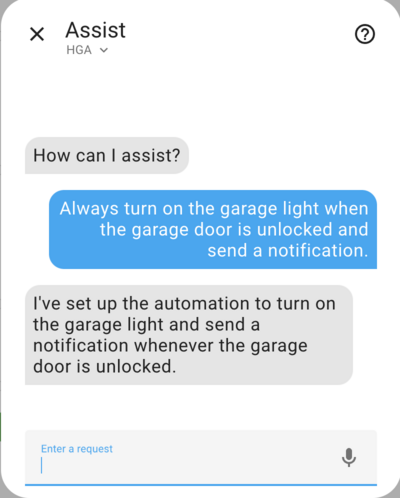

### Create an automation that runs periodically.
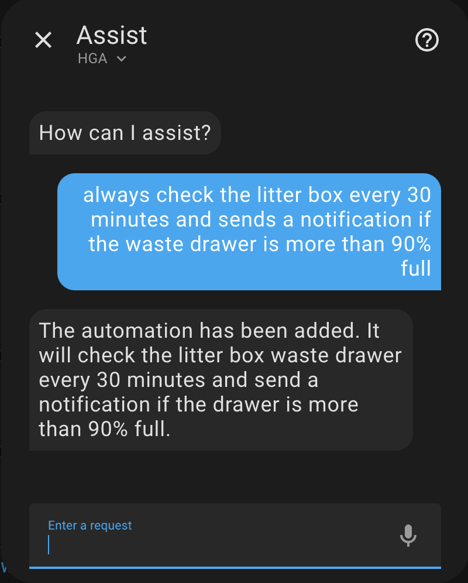

The snippet below shows that the agent is fluent in yaml based on what it generated and registered as an HA automation (this is disabled when Schema-first YAML mode is enabled).

```yaml
alias: Check Litter Box Waste Drawer
triggers:
  - minutes: /30
    trigger: time_pattern
conditions:
  - condition: numeric_state
    entity_id: sensor.litter_robot_4_waste_drawer
    above: 90
actions:
  - data:
      message: The Litter Box waste drawer is more than 90% full!
    action: notify.notify
```

### Check a single camera.
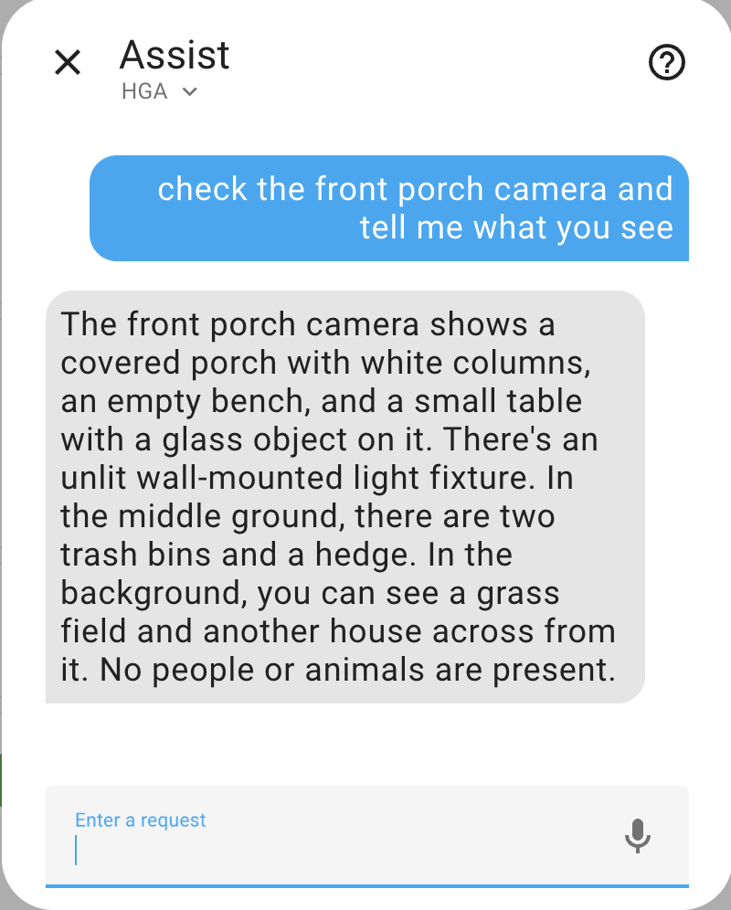

### Check multiple cameras.
https://github.com/user-attachments/assets/230baae5-8702-4375-a3f0-ffa981ee66a3

### Check the history of a light.
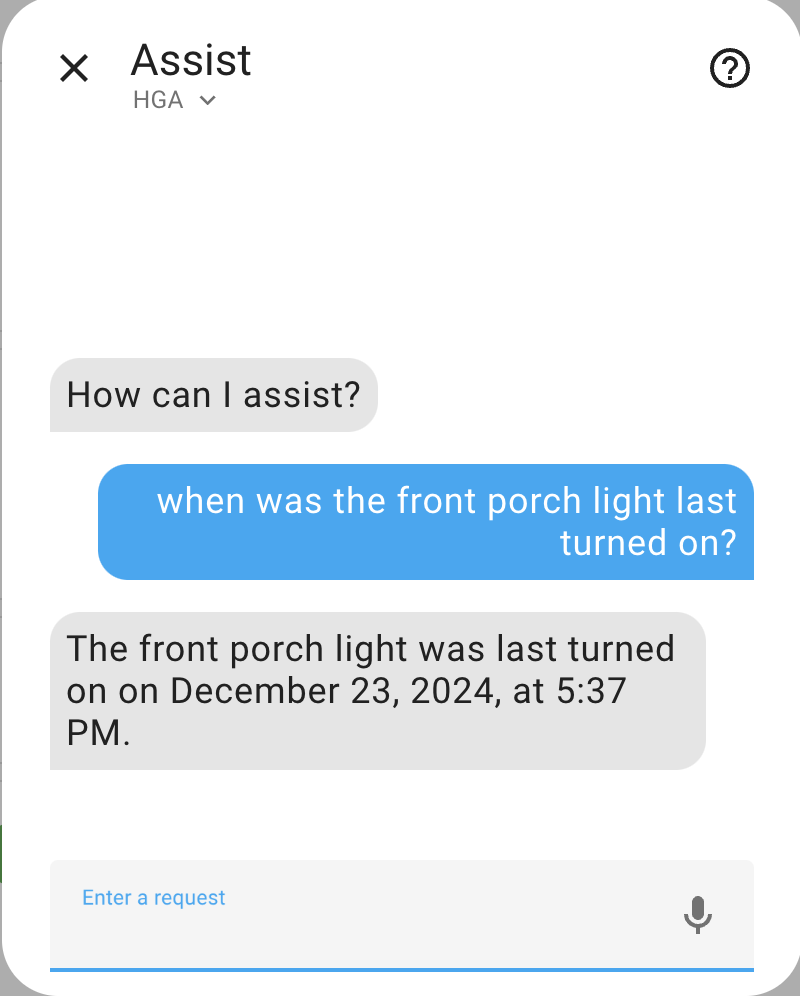

### Report the energy consumption of an appliance.
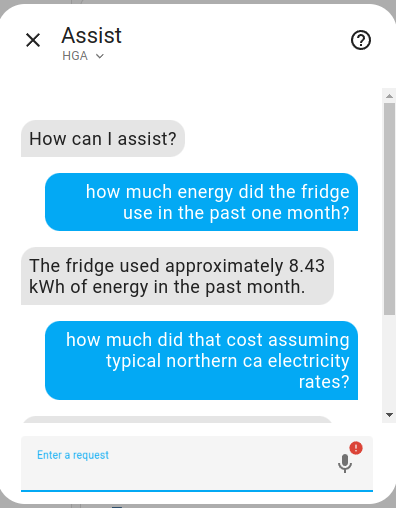 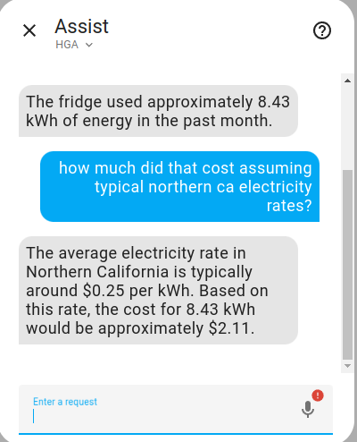

### Summarize home state.
https://github.com/user-attachments/assets/96f834a8-58cc-4bd9-a899-4604c1103a98

You can create an automation of the home state summary that runs periodically from the HA Blueprint `hga_summary.yaml` located in the `blueprints` folder.

### Long-term memory with semantic search.
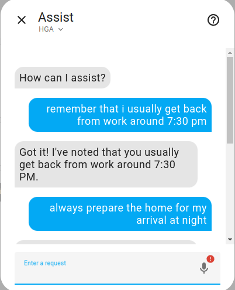
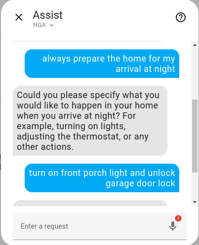
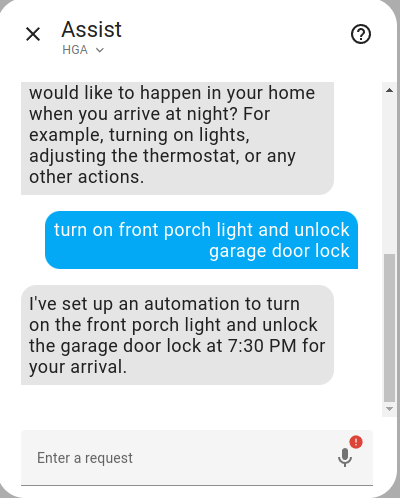

You can see that the agent correctly generates the automation below.
```yaml
alias: Prepare Home for Arrival
description: Turn on front porch light and unlock garage door lock at 7:30 PM
mode: single
triggers:
 - at: "19:30:00"
    trigger: time
actions:
  - target:
      entity_id: light.front_porch_light
    action: light.turn_on
    data: {}
  - target:
      entity_id: lock.garage_door_lock
    action: lock.unlock
    data: {}
```

### Check a camera for packages.
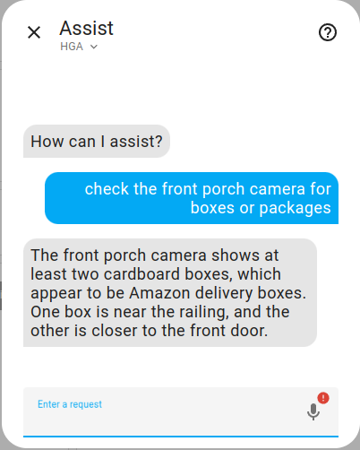

Below is the camera image the agent analyzed, you can see that two packages are visible. 

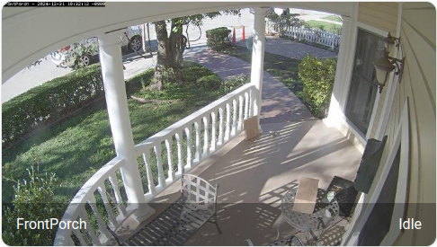

### Proactive notification of package delivery.
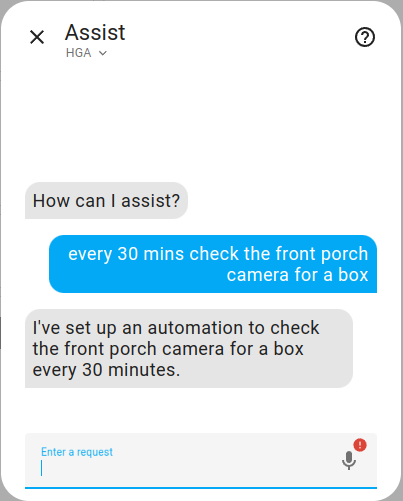

Below is an example notification from this automation if any boxes or packages are visible.

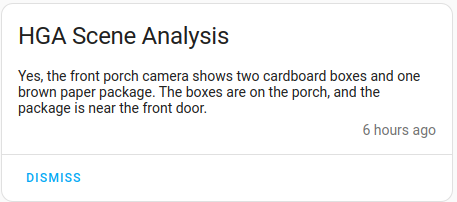

The agent uses a tool that in turn uses the HA Blueprint `hga_scene_analysis.yaml` for these requests and so the Blueprint needs to be installed in your HA installation.

### Proactive Camera Video Analysis.

You can enable proactive video scene analysis from cameras visible to Home Assistant. When enabled, motion detection will trigger the analysis which will be stored in a database for use by the agent, and optionally, notifications of the analysis will be sent to the mobile app. You can also enable anomaly detection which will only send notifications based on semantic search of the current analysis vis-a-vis the database. These options are set in the integration's config UI.

The image below is an example of a notification sent to the mobile app.

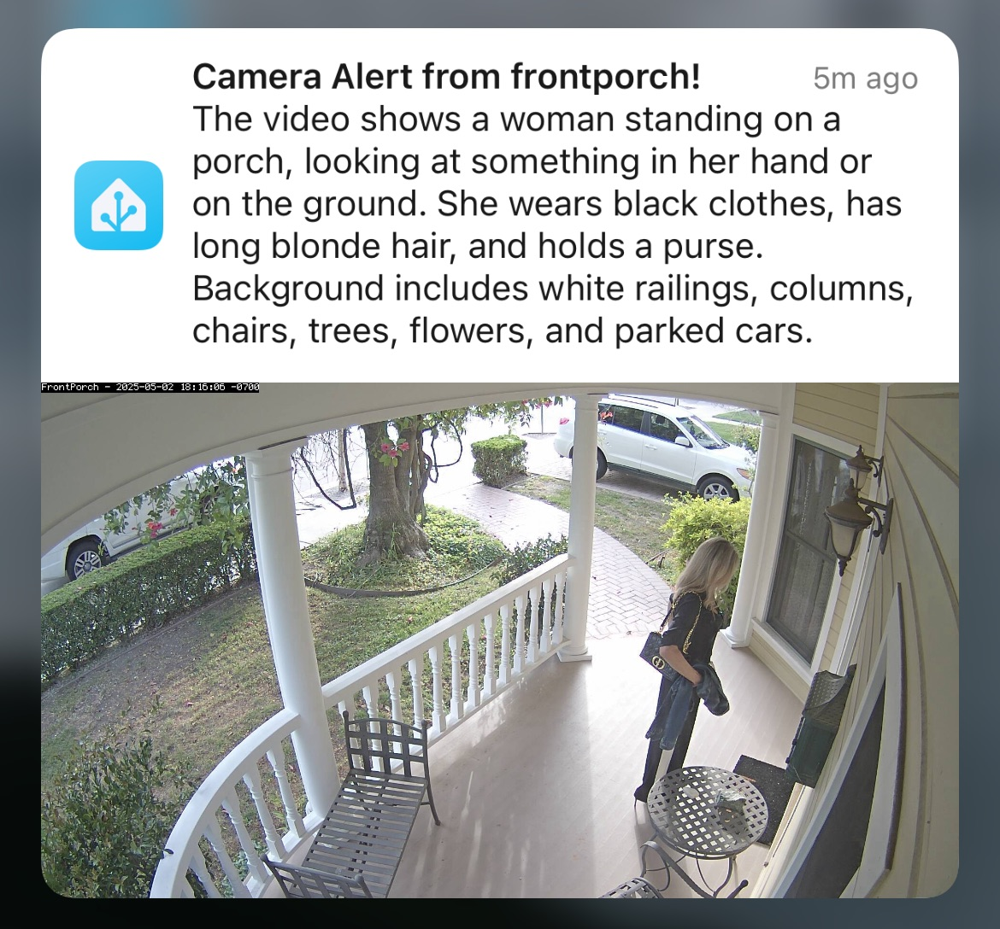

## Contributions are welcome!

If you want to contribute to this, please read the [Contribution guidelines](CONTRIBUTING.md)

***

[home_generative_agent]: https://github.com/goruck/home-generative-agent
[commits-shield]: https://img.shields.io/github/commit-activity/y/goruck/home-generative-agent.svg?style=for-the-badge
[commits]: https://github.com/goruck/home-generative-agent/commits/main
[license-shield]: https://img.shields.io/github/license/goruck/home-generative-agent.svg?style=for-the-badge
[maintenance-shield]: https://img.shields.io/badge/maintainer-Lindo%20St%20Angel%20%40goruck-blue.svg?style=for-the-badge
[releases-shield]: https://img.shields.io/github/v/release/goruck/home-generative-agent.svg?style=for-the-badge
[releases]: https://github.com/goruck/home-generative-agent/releases
<!---->
