> # MOCHI: Modular On-demand Cognitive Hydration and Injection (Home-Generative-Agent Fork)
> 
> **This is a community fork of [goruck/home-generative-agent](https://github.com/goruck/home-generative-agent).**
> 
> So, this actually started because I was trying to integrate an LLM directly into Home Assistant, and it was horrible. HA just wall dumps your entire entity list into the LLM context. I moved over to HGA because it swapped to a much better tool-based architecture.
> 
> But then I hit another wall: HGA dumps *every single tool* into every prompt, and its design is hard-limited to only allow one tool provider at a time. I wanted to add more tools and use multiple providers, but I quickly realized that doing so would just pollute the prompt all over again with massive tool lists.
> 
> To fix that, I added the RAG tool system so it only pulls the tools it actually needs. But I didn't stop there. I wanted the ability to do exact prompt assembly because I was tired of trying to pack every single behavioral rule into one massive system prompt or a bunch of hacked up tool prompts/descriptions. So, I added custom tags and the ability to attach custom prompt chunks directly to specific tools (on top of their standard descriptions) to help alleviate that and allow for fine-tuning.
> 
> The trick is that, if the system is set up correctly, every single prompt becomes highly specialized. It only has exactly what it needs for that specific task. Instead of feeding an 8B model a 1k+ token system prompt that causes it to go insane, it gets a lean, laser-focused instruction set.
> 
> ### The Core Architecture Shift
> 
> * **Dynamic Tool RAG:** Instead of feeding the model every tool at once, this uses semantic RAG to only bind the tools relevant to the current conversation.
> * **The 3.5-Tier System:** The prompt is broken down so it only has the pieces it needs, exactly when it needs them:
>   * **Tier 1 (Core):** The generalized system prompt (persona, etc.).
>   * **Tier 1.5 (Retrieved):** Custom instruction chunks dynamically injected via RAG.
>   * **Tier 2 (Provider):** Specific context for the tool provider (e.g., local Ollama vs. Cloud).
>   * **Tier 3 (Tool-Level):** Specialized Jinja2 prompt chunks for the individual tools.
> * **Jinja2 Logic Injection:** This is the crazy part. Because Jinja2 can do logic, sorting, and filtering, we can build intelligent templates that execute *before* generation. For example, if you ask about your house, it triggers the template, grabs the sensor state, does an image description, and injects that directly into the prompt chunk.
> 
> ### Why This Matters
> 
> * **Zero-Turn Generation:** In most situations, I've completely cut out the step where the LLM has to make a tool call and wait for the response. The self-hydrating chunks already have the information.
> * **Tokenomics:** It massively chomps down the token count. 4B and 7B models won't care that they are small models because they aren't processing giant prompts full of noise. You get huge intelligence with fewer cycles.
> 
> ### Other Fixes & Features
> 
> * **Multi-Select Tooling:** A `MultiLLMAPI` wrapper handles the routing across all active APIs transparently so you aren't limited to a single tool provider.
> * **Async Provider Init:** Moved Ollama init to the executor to stop it from blocking the event loop.
> * **Pre-Warmed Models:** Chat, Vision, and Summarization models now pre-warm at startup to kill the lag on the first interaction.
> * **Langgraph Stability:** Explicitly cleans up background tasks during unload to fix the "Task was destroyed but it is pending!" errors.
> * **Home Assistant 2026.4 Assist:** I chased parity with the stock HA LLM conversation agent — Assist chat on **2026.4+** gets the same ChatLog / **More info** path, so you see reasoning, tool calls, and HA native tool results instead of a dumb final line of text. Straight Q&A turns also use `QUERY_ANSWER` so core doesn't label a plain answer like you just finished an action.
> * **Instruction RAG:** Tier 1.5 chunks are scored on *both* an intent channel (name/tags) and a body channel, with a bias slider on the **Tool Manager** subentry, so one garbage similarity doesn't nuke retrieval.
> * **VLM capability:** Camera analysis has Basic / Standard / Advanced profiles (full table under Configuration); the chat model gets a small matching hint so it doesn't fight your setting.
> * **Ollama reasoning:** Optional reasoning pass for Ollama models that actually support it, per feature, when you enable it on the model step.
> 
> **Note:** Existing installations are automatically migrated on first boot. I will attempt to track upstream changes where possible, but honestly, this is a very novel system at this point.

[![GitHub Release][releases-shield]][releases]
[![GitHub Activity][commits-shield]][commits]
[![License][license-shield]](LICENSE)

![Project Maintenance][maintenance-shield]

This README is the documentation for a [Home Assistant](https://www.home-assistant.io/) (HA) integration called home-generative-agent. This project uses [LangChain](https://www.langchain.com/) and [LangGraph](https://www.langchain.com/langgraph) to create a [generative AI agent](https://arxiv.org/abs/2304.03442#) that interacts with and automates tasks within a HA smart home environment. The agent understands your home's context, learns your preferences, and interacts with you and your home to accomplish activities you find valuable. Key features include creating automations, analyzing images, and managing home states using various LLMs (Large Language Models). The architecture involves both cloud-based and edge-based models for optimal performance and cost-effectiveness. Use **Home Assistant 2026.4** or newer if you want Assist chat **More info** and ChatLog behavior to line up with the core LLM integration (older cores may still run; Assist just won't match). Installation instructions, configuration details, and information on the project's architecture and the different models used are included. The project is open-source and welcomes contributions.

These are some of the features currently supported:

- Create complex Home Assistant automations.
- Image scene analysis and understanding.
- Home state analysis of entities, devices, and areas.
- Full agent control of allowed entities in the home.
- Short- and long-term memory using semantic search.
- Automatic summarization of home state to manage LLM context length.
- Assist chat on **2026.4+**: reasoning, tools, and **More info** aligned with how the built-in HA LLM agent does it.
- Tier 1.5 instruction RAG with tunable intent-vs-body retrieval (Tool Manager).

This integration will set up the `conversation` platform, allowing users to converse directly with the Home Generative Assistant, and the `image` and `sensor` platforms which create entities to display the latest camera image, the AI-generated summary, and recognized people in HA's UI or they can be used to create automations.

## Table of Contents

- [Installation](#installation)
- [Configuration](#configuration)
- [Sentinel (Proactive Anomaly Detection)](#sentinel-proactive-anomaly-detection)
- [Image and Sensor Entities](#image-and-sensor-entities)
- [Enroll People (Face Recognition)](#enroll-people-face-recognition)
- [Architecture and Design](#architecture-and-design)
- [Example Use Cases](#example-use-cases)
- [Makefile](#makefile)
- [Contributions are welcome!](#contributions-are-welcome)

## Installation

### HACS


1. Install the [PostgreSQL with pgvector](https://github.com/goruck/addon-postgres-pgvector/tree/main/postgres_pgvector) add-on by clicking the button below and configure it according to [these directions](https://github.com/goruck/addon-postgres-pgvector/blob/main/postgres_pgvector/DOCS.md). This allows for persistence storage of conversations and memories with vector similarity search.

[](https://my.home-assistant.io/redirect/supervisor_add_addon_repository/?repository_url=https%3A%2F%2Fgithub.com%2Fgoruck%2Faddon-postgres-pgvector)

2. home-generative-agent is available in the default HACS repository. You can install it directly through HACS or click the button below to open it there.

[](https://my.home-assistant.io/redirect/hacs_repository/?owner=goruck&repository=https%3A%2F%2Fgithub.com%2Fgoruck%2Fhome-generative-agent&category=integration)

3. Add Home Generative Agent as an assistant in your Home Assistant installation by going to Settings → Voice Assistants. Use a configuration similar to the figure below.

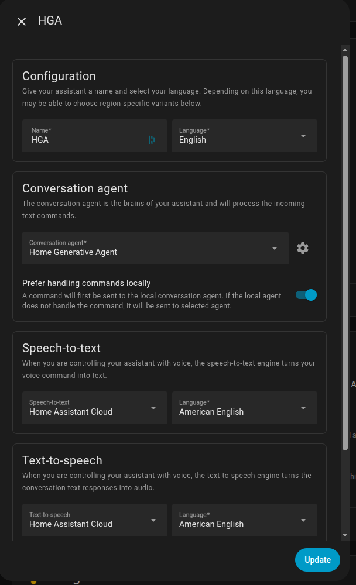

4. Install all the Blueprints in the `blueprints` directory. You can manually create automations using these that converse directly with the Agent (the Agent can also create automations for you from your your conversations with it, see examples below.)

5. (Optional) Install `ollama` on your edge device by following the instructions [here](https://ollama.com/download), **or** run any OpenAI-compatible server (vLLM, llama.cpp, LiteLLM, etc.) and add it as an **OpenAI Compatible** edge provider.

- Pull `ollama` models `gpt-oss`, `qwen3:8b`, `qwen3:1.7b`, `qwen2.5vl:7b` and `mxbai-embed-large`.

6. (Optional) Install [face-service](https://github.com/goruck/face-service) on your edge device if you want to use face recognition.

- Go to Developers tools -> Actions -> Enroll Person in the HA UI to enroll a new person into the face database from an image file.
- If you want the dashboard enrollment card, add the Lovelace resource after installing the integration:
  - Settings -> Dashboards -> Resources -> Add
  - URL: `/hga-card/hga-enroll-card.js`
  - Type: `JavaScript Module`
- If you want the Sentinel proposals dashboard card, add this resource as well:
  - Settings -> Dashboards -> Resources -> Add
  - URL: `/hga-card/hga-proposals-card.js`
  - Type: `JavaScript Module`

### Manual (non-HACS install)
1. Install PostgreSQL with pgvector as shown above in Step 1.
2. Using the tool of choice, open your HA configuration's directory (where you find `configuration.yaml`).
3. If you do not have a `custom_components` directory, you must create it.
4. In the `custom_components` directory, create a new sub-directory called `home_generative_agent`.
5. Download _all_ the files from the `custom_components/home_generative_agent/` directory in this repository.
6. Place the files you downloaded in the new directory you created.
7. Restart Home Assistant
8. In the HA UI, go to "Configuration" -> "Integrations" click "+," and search for "Home Generative Agent"
9. Follow steps 3 to 6 above.

## Configuration
Configuration is done entirely in the Home Assistant UI using subentry flows.
A "feature" is a discrete capability exposed by the integration (for example Conversation, Camera Image Analysis, or Conversation Summarization). Each feature is enabled separately and has its own model/provider configuration.

For **Assist** — the **More info** button, structured tool rows, and response typing that shipped with **Home Assistant 2026.4** — run core **2026.4** or newer. I'm not promising identical UI on older HA; the integration still works, you just don't get the same chat surface.

1. Add the integration (instruction-only screen).
   - If you previously configured the integration via the legacy flow, your settings are automatically migrated into the new subentry-based UI.
2. Click **+ Setup** on the integration page.
   - Enable optional features.
   - Configure each enabled feature’s model settings.
   - Configure the database.
   - If no model provider exists, you’ll see a reminder to add one.
   - Default features include Conversation, Camera Image Analysis, and Conversation Summarization.
3. Click **+ Model Provider** to add a provider (Edge/Cloud → provider → settings).
   - The first provider is automatically assigned to all features with default models.
4. Use a feature’s gear icon to adjust that feature’s model settings later.
5. Click **+ Sentinel** to configure proactive Sentinel behavior.
   - This is where Sentinel runtime, cooldowns, discovery, explanation, optional notify service, and autonomy level guardrails are configured.

Embedding model selection: the integration uses the first model provider that supports embeddings (or the feature’s provider when it advertises embedding capability). If you want a different embedding model, add a provider that supports embeddings and select the desired embedding model name in that provider’s defaults, then re-run Setup or reload the integration.

If you want separate servers per feature, add multiple Model Provider subentries and assign them in each feature’s settings. For example: create a “Primary Ollama” provider pointing at your chat server and a “Vision Ollama” provider pointing at your camera analysis server, then select the appropriate provider on the feature’s model settings step. You can mix provider types — for example a local vLLM server added as an **OpenAI Compatible** provider alongside an Ollama provider.

Global options (prompt, face recognition URL, context management, critical-action PIN, optional **Debug: populate Assist 'Show details' with reasoning trace**, etc.) live in the integration’s **Options** flow. Sentinel settings are configured in the **Sentinel** subentry.

### Assist chat details (Home Assistant 2026.4+)

The conversation agent streams each turn into HA's **ChatLog** the way core expects (``intent-progress`` / ``chat_log_delta``), so Assist can render thinking text, LangChain tool calls, tool results, and Home Assistant LLM API tool outcomes — same general idea as the stock LLM conversation integration. If the model emits native thinking blocks, those feed through; otherwise you only get a trace in **More info** when there's something to show, *unless* you flip **Debug: populate Assist 'Show details' with reasoning trace** in **Options**, which always fills the panel (verbose; use it when you're debugging the agent).

### VLM capability (camera image analysis)

Configure **VLM capability** on the **Camera Image Analysis** feature screen (with the vision model, temperature, and Ollama options). It controls how the `get_and_analyze_camera_image` tool builds prompts for your vision model:

| Profile | Behavior |
| -- | -- |
| **Basic (Keywords only)** | Only `detection_keywords` are sent to the VLM; a free-form `analysis_prompt` from the agent is ignored (a warning is logged if one is passed). |
| **Standard (1-2 Sentences)** | You may pass `analysis_prompt` for focused instructions; answers are asked to stay in 1–2 short sentences. You can combine with `detection_keywords`. |
| **Advanced (Detailed)** | Full free-form `analysis_prompt`; when both keywords and a prompt are provided, the user text uses **OBJECTS TO LOCATE** vs **TASK** lines so capable models (e.g. MiniCPM-V) can separate where to look from what to do. |

Default is **Advanced**. The chat model also receives a short system-message hint reflecting the selected profile so tool calling stays aligned with your setting.

### Speech-to-Text (STT)

HGA can provide a built-in STT engine using the OpenAI Whisper API so you can use voice without a separate STT integration.

1. Open Settings → Devices & Services → Home Generative Agent.
2. Click **+ STT Provider**.
3. Choose **OpenAI** and give it a name.
4. On the **Credentials** step, either:
   - Reuse an existing OpenAI Model Provider subentry, or
   - Select **Use a separate key** and enter a dedicated OpenAI API key.
5. On **Model & advanced options**, pick a model (recommended: `gpt-4o-mini-transcribe`) and set optional fields:
   - `language` (optional): e.g., `en` or `en-US`
   - `prompt` (optional): hints for domain-specific vocabulary
   - `temperature` (optional): 0–1
   - `translate`: only supported by `whisper-1`; other models will fall back to transcription
6. Go to Settings → Voice assistants → Assist pipelines and select **STT - OpenAI** (or your chosen name) for Speech-to-text.

### Schema-first YAML mode

**Schema-first JSON for YAML requests** controls how the agent handles YAML-style requests (automations, dashboards, or “show me YAML”).

When it is **ON**:
- The agent returns strict JSON that the integration converts to YAML for display.
- Automations are not auto-registered; the YAML is shown in chat.
- If you want a file you can use in Home Assistant, explicitly ask the agent to **save the YAML**. It writes under `/config/www/` and returns a `/local/...` URL.

When it is **OFF**:
- Dashboard generation is disabled; the agent will respond: “Please enable 'Schema-first JSON for YAML requests' in HGA's configuration and try again.”
- Automations are auto-registered; the YAML is not shown in chat.
- Other YAML-style requests follow the standard prompt behavior (no schema enforcement).

Note: the YAML rendered in the chat window may not preserve indentation due to UI rendering, so it may be invalid if copied directly. Use the saved file instead.

Example prompt: “Save this YAML to a file called garage-light.”

### Critical Action PIN protection

Keep unlocking and opening actions behind a second check. Open Home Assistant → Settings → Devices & Services → Home Generative Agent → Configure and toggle `Require critical action PIN` (on by default). Enter a 4-10 digit PIN to set or replace it; the value is stored as a salted hash. Leaving the field blank while the toggle is on clears the stored PIN, and turning the toggle off removes the guard entirely. In the conversation agent settings for HGA, disable `Prefer handling commands locally` for Critical Action PIN protection to work properly.

The agent will demand the PIN before it:
- Unlocks or opens locks.
- Opens covers whose entity_id includes door/gate/garage, or opens garage doors.
- Uses HA intent tools on locks. Alarm control panels use their own alarm code and never the PIN.

If you have an alarm control panel, the agent will ask for that alarm's code when arming or disarming; this code is separate from the critical-action PIN.

When you ask the agent to perform a protected action, it queues the request and asks for the PIN. Reply with the digits to complete the action; after five bad attempts or 10 minutes, the queued action expires and you must ask again. If the guard is enabled but no PIN is configured, the agent will reject the request until you set one in options.

## Sentinel (Proactive Anomaly Detection)

Sentinel adds proactive, deterministic anomaly detection and a review pipeline for generated rule proposals.

Sentinel is a singleton service per Home Generative Agent config entry. Configure exactly one Sentinel subentry.

### Architecture

1. `snapshot`: Builds an authoritative JSON snapshot (entities, camera activity, derived context).
2. `sentinel`: Runs deterministic rules on that snapshot.
3. `triage` (optional): LLM triage pass that evaluates findings and can suppress low-value alerts before notification (autonomy level ≥ 1). Fails open — on error the finding is always notified.
4. `notifier`: Orchestrates mobile push and persistent notifications with snooze actions and per-area routing.
5. `baseline` (optional): Background service that writes rolling statistical summaries per entity to a PostgreSQL table and fires temporal anomaly findings (deviation from rolling average or expected hour-of-day pattern).
6. `discovery` (optional): Uses an LLM to suggest rule candidates (advisory only).
7. `proposal` review: User promotes/approves/rejects candidates.
8. `rule_registry`: Stores approved generated rules (including active/inactive state) for deterministic runtime evaluation.
9. `audit`: Persists findings and user action outcomes.

Important: The LLM never executes actions or directly decides runtime safety behavior. Detection and actuation remain deterministic. Triage can suppress low-value notifications but cannot alter any finding field or gate execution.

### Built-in Static Rules

These rules run on every detection cycle without any configuration or approval. They cover the most common security and safety patterns out of the box:

Security / presence:

- `unlocked_lock_at_night` — exterior lock unlocked while it is night
- `open_entry_while_away` — door or window open while everyone is away
- `camera_entry_unsecured` — camera activity detected in the same area as an unsecured entry point (door, window, or lock)
- `unknown_person_camera_no_home` — unrecognized person on any camera while no one is home
- `unknown_person_camera_night_home` — unrecognized person on any camera at night while someone is home
- `alarm_disarmed_during_external_threat` — security alarm disarmed while an unrecognized person is detected on an outdoor camera

Appliances / sensors:

- `appliance_power_duration` — appliance drawing power beyond a configurable duration threshold

Cameras:

- `vehicle_detected_near_camera_home` — vehicle detected on any monitored camera while residents are home
- `camera_missing_snapshot_night_home` — any monitored camera (with active motion sensors) has no snapshot summary at night while the home is occupied (possible obstruction or outage)

Devices:

- `phone_battery_low_at_night_home` — any phone battery sensor (device_class: battery, phone keyword in entity_id or friendly name) below 20% at night while someone is home

Static rules are registered automatically at startup. They cannot be deactivated through the proposal flow; they are always evaluated as part of the deterministic detection cycle.

### Sentinel Notification Behavior

When Sentinel notifications are enabled:

- Mobile push explanation text is compact and plain-language (targeted for small screens).
- Explanation text is normalized before send (markdown/backticks removed, whitespace collapsed).
- If explanation text is missing or too long, Sentinel uses a deterministic fallback message.
- Fallback urgency wording depends on severity:
  - `high`: `Urgent: check and secure it now.`
  - `medium`: `Check soon and secure it if unexpected.`
  - `low`: `Review when convenient.`
- For `is_sensitive` findings, recognized person names in the explanation text are replaced with `"a recognised person"` before the message is sent.
- Mobile action buttons (primary action first, then False Alarm, then snooze options):
  - `Execute` — shown for non-sensitive findings with suggested actions. Calls the conversation agent or fires `hga_sentinel_execute_requested`.
  - `Ask Agent` — shown for sensitive findings with suggested actions. Hands the finding to the conversation agent, which can verify a PIN or alarm code before acting.
  - `False Alarm` — marks the alert as a false positive. Sets `user_response.false_positive = true` in the audit record, which is used to calculate the false-positive rate KPI.
  - `Snooze 24 h` — suppresses this finding type for 24 hours.
  - `Snooze Always` — suppresses this finding type permanently. A confirmation notification is sent first; the snooze is only written after the user taps **Confirm** in the follow-up notification.
- Per-area routing: when `sentinel_area_notify_map` maps an area name to a notify service, findings whose triggering entities belong to that area are routed to that service instead of the global `notify_service`.

### LLM Triage (Optional)

When `sentinel_triage_enabled` is `true`, each finding passes through an LLM triage step before notification (requires autonomy level ≥ 1).

- The triage prompt uses a restricted input allowlist — only sanitized fields are sent: `type`, `severity`, `confidence`, `is_sensitive`, `entity_count`, `suggested_actions_count`, and a small set of optional derived evidence (`is_night`, `anyone_home`, `recognized_people_count`, `last_changed_age_seconds`). Raw entity state values, attribute strings, area names, and free-form evidence text are never included.
- Triage returns a `decision` (`notify` or `suppress`) and a `reason_code` for audit.
- `triage_confidence` is recorded in the audit log but does not gate execution.
- Triage cannot alter any finding field — it can only gate the notification.
- Fails open: on timeout or error the decision becomes `notify` with `reason_code: triage_error`.

Configuration options (in the Sentinel subentry):

- `sentinel_triage_enabled` — enable LLM triage (default: `false`)
- `sentinel_triage_timeout_seconds` — max time to wait for triage LLM response (default: `10`)

### Baseline Collection (Optional)

When `sentinel_baseline_enabled` is `true` **and** `sentinel_enabled` is `true`, a background `SentinelBaselineUpdater` task writes rolling statistical summaries (per entity, per metric) to a `sentinel_baselines` PostgreSQL table on a configurable cadence.

On each detection cycle the engine calls `async_fetch_baselines()` to read current baseline values from PostgreSQL and passes them to the dynamic-rule evaluators. Two temporal templates are always registered:

- `baseline_deviation` — fires when a numeric entity state deviates from its rolling average by more than `threshold_pct` percent (default `50.0`).
- `time_of_day_anomaly` — fires when a numeric entity state differs from the expected hour-of-day rolling average by more than `threshold_pct` percent (default `50.0`).

`threshold_pct`, `entity_id`, and `metric` are per-rule `params` stored in the rule registry — they are set when a rule is created via discovery or the `hga_sentinel_add_rule` service, not in the subentry. Both templates produce no findings while the table is empty (baselines accumulate over time).

Baseline freshness states (returned by `SentinelBaselineUpdater.check_freshness()`):

- `fresh` — baseline was updated within the freshness threshold
- `stale` — baseline exists but is older than the freshness threshold
- `unavailable` — no baseline record exists for this entity/metric

Configuration options (in the Sentinel subentry):

- `sentinel_baseline_enabled` — enable baseline collection (default: `false`); has no effect unless `sentinel_enabled` is also `true`
- `sentinel_baseline_update_interval_minutes` — how often baselines are recalculated (default: `15`)
- `sentinel_baseline_freshness_threshold_seconds` — age after which a baseline is considered stale (default: `3600`)
- `sentinel_baseline_min_samples` — minimum number of samples before a baseline is considered usable (default: `10`)
- `sentinel_baseline_max_samples` — rolling window size; older samples are discarded when this is reached (default: `288`)
- `sentinel_baseline_drift_threshold_pct` — default percent deviation that triggers a `baseline_deviation` or `time_of_day_anomaly` finding (default: `50.0`)

### Sentinel Action Flows

When a user taps an action button, Sentinel uses a two-tier dispatch strategy: it first attempts to call the HGA conversation agent directly via `conversation.process`; if no conversation entity is available it falls back to firing a Home Assistant event so blueprints/automations can handle the request.

#### Execute (non-sensitive findings)

1. **Agent available** — calls the conversation agent with a natural-language prompt describing the finding and suggested actions. The agent checks live context, takes action, and its reply is pushed back as a mobile notification (when `notify_service` is configured).
2. **Agent unavailable** — fires `hga_sentinel_execute_requested` so a blueprint or automation can handle it.
3. **Sensitive finding** — blocked with status `blocked`.

#### Ask Agent / Handoff (sensitive findings)

1. **Agent available** — calls the conversation agent with a security-focused prompt. The agent can verify a PIN or alarm code (if configured under Critical Action settings) before executing. Its reply is pushed back as a mobile notification.
2. **Agent unavailable** — fires `hga_sentinel_ask_requested` (includes a `suggested_prompt` field) so a blueprint can route it to the agent.

#### Event payloads

Both `hga_sentinel_execute_requested` and `hga_sentinel_ask_requested` share these fields:

- `requested_at`
- `anomaly_id`
- `type`
- `severity`
- `confidence`
- `triggering_entities`
- `suggested_actions`
- `is_sensitive`
- `evidence`
- `mobile_action_payload`

`hga_sentinel_ask_requested` additionally includes:

- `suggested_prompt` — a ready-to-use natural-language prompt for the conversation agent.

### Sentinel Blueprints

Three draft blueprints are included in the `blueprints/` folder:

- `hga_sentinel_execute_router.yaml`
- `hga_sentinel_execute_escalate_high.yaml`
- `hga_sentinel_ask_router.yaml`

How to import in Home Assistant:

1. Open `Settings` -> `Automations & Scenes` -> `Blueprints`.
2. Import each YAML from this repository's `blueprints/` directory.
3. Create automations from the imported blueprints and configure inputs.

What each blueprint does:

- `hga_sentinel_execute_router.yaml`: routes `hga_sentinel_execute_requested` by `suggested_actions` to scripts (`arm_alarm`, `check_appliance`, `check_camera`, `check_sensor`, `close_entry`, `lock_entity`) with default fallback support.
- `hga_sentinel_execute_escalate_high.yaml`: handles only `severity: high` execute events and can send persistent notifications, mobile push, and optional TTS.
- `hga_sentinel_ask_router.yaml`: routes `hga_sentinel_ask_requested` events to the HGA conversation agent. The agent receives the `suggested_prompt` from the event, can verify a PIN if needed, and sends its response back as a notification.

Recommended usage:

- Start with `hga_sentinel_execute_escalate_high.yaml` for immediate high-priority visibility.
- Add `hga_sentinel_execute_router.yaml` when you have scripts ready for action-specific handling.
- Add `hga_sentinel_ask_router.yaml` as a fallback for sensitive findings when the built-in agent dispatch is not available (e.g., the conversation entity is not yet registered at startup).

Script contract for router targets:

- Router script calls pass one object in `data.sentinel_event`.
- `sentinel_event` matches the execute event payload and includes:
  - `requested_at`
  - `anomaly_id`
  - `type`
  - `severity`
  - `confidence`
  - `triggering_entities`
  - `suggested_actions`
  - `is_sensitive`
  - `evidence`
  - `mobile_action_payload`

Where to store these scripts in Home Assistant:

- Create them as regular HA scripts: `Settings` -> `Automations & Scenes` -> `Scripts` -> `+ Create Script` -> `Edit in YAML`.
- Save each with a stable script entity ID (for example `script.hga_check_camera_flow`) so it can be selected in `hga_sentinel_execute_router.yaml`.
- If you manage YAML directly, store them in `scripts.yaml` (or an included scripts file) and reload scripts.

Example script target for `check_appliance`:

```yaml
alias: HGA Check Appliance Flow
mode: queued
fields:
  sentinel_event:
    description: Sentinel execute event payload
sequence:
  - action: persistent_notification.create
    data:
      title: "HGA Appliance Follow-up"
      message: >
        Type={{ sentinel_event.type }},
        severity={{ sentinel_event.severity }},
        entities={{ sentinel_event.triggering_entities | join(', ') }}.
  - action: notify.mobile_app_phone
    data:
      title: "HGA Appliance Follow-up"
      message: >
        Suggested actions:
        {{ sentinel_event.suggested_actions | join(', ') if sentinel_event.suggested_actions else 'none' }}
```

Example script target for `check_camera`:

```yaml
alias: HGA Check Camera Flow
mode: queued
fields:
  sentinel_event:
    description: Sentinel execute event payload
sequence:
  - action: notify.mobile_app_phone
    data:
      title: "HGA Camera Follow-up"
      message: >
        Camera-related event {{ sentinel_event.type }}.
        Entities={{ sentinel_event.triggering_entities | join(', ') if sentinel_event.triggering_entities else 'none' }}.
  - action: persistent_notification.create
    data:
      title: "HGA Camera Follow-up"
      message: >
        Evidence: {{ sentinel_event.evidence }}
```

Example script target for `lock_entity`:

```yaml
alias: HGA Lock Entity Follow-up
mode: queued
fields:
  sentinel_event:
    description: Sentinel execute event payload
sequence:
  - variables:
      lock_id: >
        
        {{ ids[0] if ids else '' }}
  - choose:
      - conditions:
          - condition: template
            value_template: "{{ lock_id.startswith('lock.') }}"
        sequence:
          - action: lock.lock
            target:
              entity_id: "{{ lock_id }}"
    default:
      - action: persistent_notification.create
        data:
          title: "HGA Lock Entity Follow-up"
          message: >
            Could not resolve lock entity from event:
            {{ sentinel_event.triggering_entities | default([], true) }}
```

Tip: if your script needs the raw mobile action callback details, read `sentinel_event.mobile_action_payload`.

### Supported Generated Rule Templates

Security / presence:

- `unlocked_lock_when_home` — lock unlocked while someone is home
- `unlocked_lock_while_away` — lock unlocked while no one is home
- `alarm_disarmed_open_entry` — alarm disarmed with an entry sensor open
- `alarm_state_mismatch` — alarm in a specific state (armed or disarmed) that contradicts current or expected occupancy
- `open_entry_when_home` — entry open while someone is home
- `open_entry_while_away` — entry open while away
- `open_entry_at_night_when_home` — entry open at night while home
- `open_entry_at_night_while_away` — entry open at night while away
- `open_any_window_at_night_while_away` — any window open at night while away
- `multiple_entries_open_count` — N or more entries open simultaneously
- `unknown_person_camera_no_home` — unrecognized person on camera while away
- `unknown_person_camera_when_home` — unrecognized person on camera while home
- `motion_detected_at_night_while_alarm_disarmed` — motion at night with alarm disarmed
- `motion_without_camera_activity` — motion sensor active without corresponding camera activity
- `motion_while_alarm_disarmed_and_home_present` — motion with alarm disarmed and person home

Duration / staleness:

- `entity_state_duration` — lock or entry held in a state (e.g. unlocked, open) beyond a time threshold
- `entity_staleness` — person or sensor entity not updated within an expected window

Sensors / appliances:

- `sensor_threshold_condition` — numeric sensor (e.g. power, energy) exceeds a threshold, with optional night/away/home condition
- `low_battery_sensors` — battery sensor at or below a threshold
- `unavailable_sensors` — sensors in `unavailable` state
- `unavailable_sensors_while_home` — sensors in `unavailable` state while someone is home

Baseline / temporal:

- `baseline_deviation` — numeric entity deviates from its rolling average
- `time_of_day_anomaly` — numeric entity differs from expected hour-of-day rolling average

### Discovery Novelty and Dedupe

Discovery suggestions are deduped in the backend before being stored.

Novelty checks compare candidates against:
- Active static and dynamic rules (static built-in rule IDs are always included so the LLM is informed which topics are already covered)
- Existing proposal drafts in all statuses, including `rejected` (rejected proposals block re-suggestion just as approved ones do)
- Recent discovery records

Candidates with a resolvable subject and predicate are matched by a deterministic semantic key (`v1|subject=...|predicate=...|...`). Candidates that do not resolve to a known subject/predicate (for example, abstract data-quality observations with no entity references) fall back to a title+summary hash (`ident|sha256=...`) so they are still suppressed across cycles.

Discovery records may include:
- `semantic_key`: canonical normalized key for candidate meaning
- `dedupe_reason`: candidate disposition (`novel`, `existing_semantic_key`, `existing_identity_hash`, `batch_duplicate`)
- `filtered_candidates`: candidates removed by dedupe with their reason

### Configuring Discovery, Triage, and Baseline

These optional features are configured in the Sentinel subentry:

1. Home Assistant -> `Settings` -> `Devices & Services`
2. Open `Home Generative Agent`
3. Select `+ Sentinel` (or reconfigure the existing Sentinel subentry)
4. Set options:
   - Discovery: `sentinel_discovery_enabled`, `sentinel_discovery_interval_seconds`, `sentinel_discovery_max_records`
   - Daily digest: `sentinel_daily_digest_enabled` (default `false`), `sentinel_daily_digest_time` (default `08:00` local time — sends a push summary of the past 24 hours at that time each day)
   - Triage: `sentinel_triage_enabled`, `sentinel_triage_timeout_seconds`
   - Baseline: `sentinel_baseline_enabled`, `sentinel_baseline_update_interval_minutes`, `sentinel_baseline_freshness_threshold_seconds`
   - Autonomy guardrails: `sentinel_require_pin_for_level_increase` and the Sentinel autonomy-level increase PIN
   - Per-area notifications: `sentinel_area_notify_map` (area name → notify service, e.g. `{"Garage": "notify.mobile_app_garage_tablet"}`)
   - Audit store size: `audit_hot_max_records` (default 500) — maximum records kept in the local hot store. Records with `suppression_reason_code == "not_suppressed"` (user-visible findings) are always preserved in preference to suppressed records when the store is at capacity.

Discovery and baseline both require `sentinel_enabled` to be `true` — they will not start if anomaly alerting is disabled. Discovery and triage also require a configured chat model; if no model is available, those loops are skipped.

### Proposal Lifecycle

Proposal draft statuses:
- `draft`
- `approved`
- `rejected`
- `unsupported`
- `covered_by_existing_rule`

`covered_by_existing_rule` means the candidate is semantically covered by an active rule and should not be approved as a separate rule. `covered_rule_id` is attached when available, and overlap metadata such as `overlapping_entity_ids` may also be returned to show which entities drove the match.

When a proposal is approved and successfully mapped to a supported deterministic template, Sentinel registers the dynamic rule and runs an immediate evaluation cycle so the new rule can take effect without waiting for the next scheduled loop.

If you want a dry-run before approval, use `preview_rule_proposal`. It evaluates the normalized rule against the current snapshot without mutating the dynamic rule registry.

### Sentinel Services

- `home_generative_agent.get_discovery_records`
- `home_generative_agent.trigger_sentinel_discovery`
- `home_generative_agent.promote_discovery_candidate`
- `home_generative_agent.get_proposal_drafts`
- `home_generative_agent.preview_rule_proposal`
- `home_generative_agent.approve_rule_proposal`
- `home_generative_agent.reject_rule_proposal`
- `home_generative_agent.get_dynamic_rules`
- `home_generative_agent.deactivate_dynamic_rule`
- `home_generative_agent.reactivate_dynamic_rule`
- `home_generative_agent.get_audit_records`
- `home_generative_agent.sentinel_set_autonomy_level`
- `home_generative_agent.sentinel_get_baselines`
- `home_generative_agent.sentinel_reset_baseline`

Typical response fields:
- `status`
- `candidate_id`
- `rule_id`
- `template_id`
- `covered_rule_id`
- `reason_code`
- `details`
- `would_trigger`
- `matching_entity_ids`
- `findings`
- `overlapping_entity_ids`
- `records`
- `enabled`

Notable service behavior:
- `home_generative_agent.trigger_sentinel_discovery` runs one discovery cycle immediately using the current snapshot.
- `home_generative_agent.preview_rule_proposal` evaluates a stored proposal draft against the current snapshot without registering the rule and returns whether it would trigger right now.
- `home_generative_agent.sentinel_set_autonomy_level` is admin-only and applies a TTL-bounded runtime override. If `sentinel_require_pin_for_level_increase` is enabled, increasing the level requires the Sentinel PIN.
- `home_generative_agent.sentinel_get_baselines` returns raw baseline statistics for all tracked entities regardless of sample count; returns `{"status": "error"}` when the DB is unreachable.
- `home_generative_agent.sentinel_reset_baseline` deletes baseline data for one entity or all entities. Omit `entity_id` to reset all. Fires a confirmation notification after deletion; returns `{"status": "error"}` when the DB is unreachable.
- Proposal approval responses may include structured normalization failures such as `reason_code: missing_required_entities` with a `details` payload, rather than a plain unsupported status.

### Sentinel Health Sensor

Sentinel registers a `sensor.sentinel_health` entity that is updated after every detection run. Its state is `ok` when Sentinel is enabled and `disabled` otherwise.

Attributes:

| Attribute | Description |
|---|---|
| `last_run_start` | UTC ISO 8601 timestamp when the last run started |
| `last_run_end` | UTC ISO 8601 timestamp when the last run ended |
| `run_duration_ms` | Last run duration in milliseconds |
| `active_rule_count` | Number of active rules evaluated |
| `trigger_source_breakdown` | Rolling 24-hour trigger counts broken down by source: `{poll: N, event: N, on_demand: N}` |
| `discovery_candidates_generated` | Total discovery candidates returned by the LLM in the most recent cycle |
| `discovery_candidates_novel` | Candidates that passed deduplication and were stored |
| `discovery_candidates_deduplicated` | Candidates dropped as duplicates of existing keys |
| `discovery_proposals_promoted` | Proposals promoted to draft status in the most recent cycle |
| `discovery_unsupported_ttl_expired` | Unsupported proposals whose TTL expired and were cleaned up |
| `triggers_coalesced` | Cumulative events merged into an existing queued trigger (deduplication) |
| `triggers_dropped_incoming` | Cumulative triggers dropped on arrival because all queue slots held security-critical triggers |
| `triggers_dropped_queued` | Cumulative lower-priority queued triggers evicted to make room for a security-critical incoming trigger |
| `triggers_ttl_expired` | Cumulative queued triggers discarded because they aged past the TTL before the engine could process them |
| `findings_count_by_severity` | Count of findings by severity: `{low: N, medium: N, high: N}` |
| `triage_suppress_rate` | Percentage of triaged findings suppressed by triage (null if no findings were triaged) |
| `auto_exec_count` | Number of autonomous execution attempts |
| `auto_exec_failures` | Number of autonomous execution errors |
| `action_success_rate` | Overall action success rate including user-triggered executions (null if no actions recorded) |
| `user_override_rate` | Percentage of user-visible findings that received a user response (null if no user-visible findings) |
| `false_positive_rate_14d` | Percentage of user-visible findings in the last 14 days marked as false positives (null if no data) |
| `baseline_entity_count` | Total number of entities with at least one baseline record |
| `baseline_fresh_count` | Number of entities whose baseline was updated within the freshness threshold |
| `baseline_stale_count` | Number of entities whose baseline exists but is older than the freshness threshold |
| `baseline_rules_waiting` | Number of active baseline rules whose entity has not yet reached `sentinel_baseline_min_samples` |
| `baseline_last_update` | UTC ISO 8601 timestamp of the most recent baseline write (null if no baselines yet) |

Example Lovelace Markdown card:

```yaml
type: markdown
content: |
  ## Sentinel Health
  **State:** {{ states('sensor.sentinel_health') }}

  **Last run:** {{ state_attr('sensor.sentinel_health', 'last_run_start') or '—' }}
  **Duration:** {{ state_attr('sensor.sentinel_health', 'run_duration_ms') or '—' }} ms
  **Active rules:** {{ state_attr('sensor.sentinel_health', 'active_rule_count') or '—' }}

  **Trigger drops (incoming / queued / TTL):**
  {{ state_attr('sensor.sentinel_health', 'triggers_dropped_incoming') or 0 }} /
  {{ state_attr('sensor.sentinel_health', 'triggers_dropped_queued') or 0 }} /
  {{ state_attr('sensor.sentinel_health', 'triggers_ttl_expired') or 0 }}

  **Findings (low / med / high):**
  
  {{ sev.get('low', 0) }} / {{ sev.get('medium', 0) }} / {{ sev.get('high', 0) }}

  **Action success rate:** {{ state_attr('sensor.sentinel_health', 'action_success_rate') or '—' }}%
  **False positive rate (14d):** {{ state_attr('sensor.sentinel_health', 'false_positive_rate_14d') or '—' }}%

  **Baselines (fresh / stale / total):**
  {{ state_attr('sensor.sentinel_health', 'baseline_fresh_count') or 0 }} /
  {{ state_attr('sensor.sentinel_health', 'baseline_stale_count') or 0 }} /
  {{ state_attr('sensor.sentinel_health', 'baseline_entity_count') or 0 }}
  
  **Rules waiting for baseline:** {{ state_attr('sensor.sentinel_health', 'baseline_rules_waiting') }}
  
  **Baseline last updated:** {{ state_attr('sensor.sentinel_health', 'baseline_last_update') or '—' }}
```

### Proposals Card (Optional)

If you install `hga-proposals-card.js`, the card can drive the full review flow:
- Discovery candidates
- Filtered discovery candidates (with dedupe reasons)
- Proposal drafts (pending)
- Proposal history

It also supports:
- Promote to draft
- Preview rule proposal before approval
- Reject candidate (local dismiss in browser storage)
- Approve/reject proposal
- Collapsible sections (Proposal Drafts is expanded by default)
- "Request New Template" shortcut that opens a prefilled GitHub issue form
- Immediate "Template Requested" feedback after click (stored per candidate in browser local storage)
- Deactivate/reactivate controls for historical approved rules

Installation:
1. Go to `Settings -> Dashboards -> Resources -> Add Resource`.
2. Add:
   - URL: `/hga-card/hga-proposals-card.js`
   - Type: `JavaScript Module`
3. Add the card to a dashboard using a manual card config:

```yaml
type: custom:hga-proposals-card
title: Sentinel Proposals
```

Notes:
- The card type must include the `custom:` prefix.
- If the card shows as unknown after adding the resource, hard refresh the browser and reload frontend resources.
- Legacy resource URLs under `/hga-enroll-card/...` still work for backward compatibility.

When updating card JS, bump the Lovelace resource query string (for example `?v=12`) to avoid stale browser cache.

### Unsupported Proposals

`unsupported` means the candidate could not be mapped to a supported deterministic template. Approval responses can also include structured normalization details such as `reason_code` and `details` to explain why mapping failed, for example `missing_required_entities`, `no_matching_entity_types`, or `unsupported_pattern`.

Preferred handling:
1. Reject if not useful. Once rejected, the candidate is excluded from all future discovery cycles (its semantic key or identity hash is added to the exclusion context).
2. If useful, request a new template via `.github/ISSUE_TEMPLATE/feature_rule_request.yml` (the card pre-populates relevant fields from the proposal and marks the candidate as "Template Requested" locally in the browser).
3. After template support is added, re-approve the proposal to re-evaluate with current mapping logic.

Unsupported proposals that are never acted on are automatically removed after 30 days.

Compatibility note: the normalization engine handles all evidence path formats produced by the discovery engine:

- `entities[entity_id=domain.object_id]` (snapshot query format)
- `entities[entity_ids contains domain.object_id].attr` (discovery format)
- `domain.object_id.attribute` (dot-notation, e.g. `sensor.power_meter.state`, `lock.front_door.battery_level`)

Domainless object IDs (for example `entities[entity_id=backyard_vmd3_0].state`) are also accepted for entry and sensor templates. Stored drafts from any discovery version can be re-approved without modification.

Normalization fallbacks for common LLM-generated patterns:

- **Power/energy sensor without numeric threshold** (e.g. `high_energy_consumption_night`): when no explicit value like "above 500W" appears in the candidate text, normalization falls back to `baseline_deviation` so the rule fires when the sensor deviates from its rolling average rather than a fixed threshold.
- **Lock battery low** (e.g. `playroom_lock_battery_low`): when a lock entity appears in evidence paths alongside "battery low/below" text, normalization routes to `low_battery_sensors` rather than `unlocked_lock_when_home`.
- **Alarm disarmed with no occupancy signal** (e.g. `alarm_disarmed_during_external_threat`): `alarm_state_mismatch` also matches candidates whose text contains "disarmed" without an armed-state keyword, and defaults `expected_presence` to `"home"` when no home/away signal is present.
- **Window/entry open duration without entity IDs in evidence** (e.g. `window_open_duration_exceeded`): when evidence paths contain no window entity references, normalization falls back to `open_any_window_at_night_while_away` using a selector-based approach that checks all window sensors.

`unavailable_sensors` is also supported for candidates without explicit occupancy context (for example `backyard_sensors_unavailable`). It triggers only when all listed sensors are `unavailable`; if any required sensor is missing or not unavailable, no finding is produced.

`motion_while_alarm_disarmed_and_home_present` is supported for candidates that provide motion entities, an alarm entity, and one or more `person.*` entities in evidence paths. It triggers only when all required entities are present and states match exactly: alarm `disarmed`, motion `on`, and person `home`.

`motion_detected_at_night_while_alarm_disarmed` is supported for candidates that provide motion entities, an alarm entity, and `derived.is_night` evidence (for example candidate `motion_at_night_disarmed`). It triggers only when all required entities referenced by the rule are present, snapshot `derived.is_night` is `true`, alarm state is `disarmed`, and at least one motion entity is `on`. It returns no findings when required entities are missing.

`low_battery_sensors` is supported for battery entity candidates (for example `sensor.elias_t_h_battery` and `sensor.girls_t_h_battery`). It triggers when any listed sensor is at or below the configured threshold (default `40%`) and produces no findings if any required entity is missing or has a non-numeric state.

### Troubleshooting

- If card UI looks unchanged after an update, you are likely serving cached JS.
- If similar candidates keep appearing, inspect `dedupe_reason` and `filtered_candidates` in discovery records.
- If a proposal appears duplicate, check logs for:
  - `Rule registry ignored duplicate rule ...`
  - `... covered_by_existing_rule ...`
- Existing stored proposal drafts are not auto-migrated; statuses update when proposals are re-processed.

## Image and Sensor Entities

This section shows how to display the latest camera image, the AI-generated summary, and recognized people in Home Assistant or use in automations via the image and sensor platforms.

### Overview
 
   * Image entities (1 per camera): `image.<camera_slug>_last_event`. Shows the most recent snapshot published by the analyzer/service.

   * Sensor entities (1 per camera): `sensor.<camera_slug>_recognized_people`
   
   * Attributes include:
      * recognized_people: names from face recognition
      * summary: AI description of the last frame
      * latest_path: filesystem path of the published image
      * count, last_event, camera_id: aux info

The analyzer publishes snapshots automatically on motion/recording, and you can also invoke a service to capture and analyze now. For this to work, HA needs to have write access to your snapshots location (default: `/media/snapshots`) and your camera entities must exist in HA (`camera.*`).

In the examples below, replace the entity names with the actuals from your HA installation.

### Publish a Latest Event (On Demand)

A service is provided to capture a fresh snapshot, analyze it, and publish it as the latest event.

- Service: `home_generative_agent.save_and_analyze_snapshot`
   - target: one or more camera.* entities
   - fields:
      - protect_minutes (optional, default: 30) — protect the new file from pruning

Example -> Developer Tools -> Services:

```yaml
service: home_generative_agent.save_and_analyze_snapshot
target:
  entity_id:
    - camera.frontgate
    - camera.backyard
data:
  protect_minutes: 30
```

Example Button Card in UI:

```yaml
type: button
name: Refresh Frontgate
icon: mdi:camera
tap_action:
  action: call-service
  service: home_generative_agent.save_and_analyze_snapshot
  target:
    entity_id: camera.frontgate
```

### Dashboards (Lovelace) — Show Image + Summary + Names

* Simple Image and Markdown (two cards per camera)

```yaml
type: grid
columns: 2
square: false
cards:
  - type: vertical-stack
    cards:
      - type: picture-entity
        entity: image.frontgate_last_event
        show_name: false
        show_state: false
      - type: markdown
        content: |
          **Summary**
          {{ state_attr('image.frontgate_last_event', 'summary') or '—' }}

          **Recognized**
          
          {{ names | join(', ') if names else 'None' }}
```

Duplicate the stack for each camera’s `image.<slug>_last_event`.

* All in one cameras view

```yaml
title: Cameras
path: cameras
cards:
  - type: grid
    columns: 2
    square: false
    cards:
      # Repeat this block for each camera slug
      - type: vertical-stack
        cards:
          - type: picture-entity
            entity: image.frontgate_last_event
            show_name: false
            show_state: false
          - type: markdown
            content: |
              **Summary**
              {{ state_attr('image.frontgate_last_event', 'summary') or '—' }}

              **Recognized**
              
              {{ names | join(', ') if names else 'None' }}
```

* Overlay: Place Text on the Image

```yaml
type: picture-elements
image: /api/image_proxy/image.frontgate_last_event
elements:
  - type: markdown
    content: >
      
      **{{ names | join(', ') if names else 'None' }}**
    style:
      top: 6%
      left: 50%
      width: 92%
      color: white
      text-shadow: 0 0 6px rgba(0,0,0,0.9)
      transform: translateX(-50%)
  - type: state-label
    entity: image.frontgate_last_event
    attribute: summary
    style:
      bottom: 6%
      left: 50%
      width: 92%
      color: white
      text-shadow: 0 0 6px rgba(0,0,0,0.9)
      transform: translateX(-50%)
```

### Automations

Notify when people are recognized on any camera:

```yaml
alias: Camera recognized people
mode: parallel
trigger:
  - platform: state
    entity_id:
      - sensor.frontgate_recognized_people
      - sensor.playroomdoor_recognized_people
      - sensor.backyard_recognized_people
condition: []
action:
  - variables:
      ent: "{{ trigger.entity_id }}"
      cam: "{{ state_attr(ent, 'camera_id') }}"
      names: "{{ state_attr(ent, 'recognized_people') or [] }}"
      summary: "{{ state_attr(ent, 'summary') or 'An event occurred.' }}"
      image_entity: "image.{{ cam.split('.')[-1] }}_last_event"
  - service: notify.mobile_app_phone
    data:
      title: "Camera: {{ cam }}"
      message: >
        {{ summary }}
         Recognized: {{ names | join(', ') }}.
      data:
        image: >
          {{ state_attr(image_entity, 'entity_picture') }}
```

### Events and Signals

* Event `hga_last_event_frame` is fired whenever a new “latest” frame is published.

```json
{
  "camera_id": "camera.frontgate",
  "summary": "A person approaches the gate...",
  "path": "/media/snapshots/camera_frontgate/snapshot_YYYYMMDD_HHMMSS.jpg",
  "latest": "/media/snapshots/camera_frontgate/_latest/latest.jpg"
}
```

* Dispatcher signals (internal):

  * `SIGNAL_HGA_NEW_LATEST` -> updates image.*_last_event

  * `SIGNAL_HGA_RECOGNIZED` -> updates sensor.*_recognized_people

Most users won’t need to consume these directly; the platform entities update automatically.

## Enroll People (Face Recognition)

You can enroll faces either via a service call or through the dashboard card.

### Service (Developer Tools -> Actions)

Service: `home_generative_agent.enroll_person`

```yaml
service: home_generative_agent.enroll_person
data:
  name: "Eva"
  file_path: "/media/faces/eva_face.jpg"
```

The file must be inside Home Assistant's `/media` folder so it is accessible to the integration.

### Dashboard Card (File Picker)

Add the custom card to any dashboard after registering the resource in Installation step 6.

```yaml
type: custom:hga-enroll-card
title: Enroll Person
endpoint: /api/home_generative_agent/enroll
```

Use the file picker or drag-and-drop to upload one or more images. The card will enroll any images that contain a detectable face and skip those that do not.

## Architecture and Design

Below is a high-level view of the architecture.

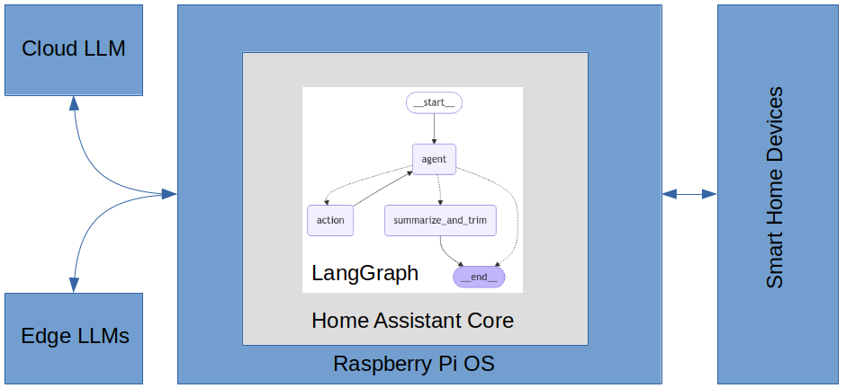

The general integration architecture follows the best practices as described in [Home Assistant Core](https://developers.home-assistant.io/docs/development_index/) and is compliant with [Home Assistant Community Store](https://www.hacs.xyz/) (HACS) publishing requirements.

The agent is built using LangGraph and uses the HA `conversation` component to interact with the user. The agent uses the Home Assistant LLM API to fetch the state of the home and understand the HA native tools it has at its disposal. I implemented all other tools available to the agent using LangChain. The agent employs several LLMs, a large and very accurate primary model for high-level reasoning, smaller specialized helper models for camera image analysis, primary model context summarization, and embedding generation for long-term semantic search. The models can be either cloud (best accuracy, highest cost) or edge-based (good accuracy, lowest cost). Edge models run under the [Ollama](https://ollama.com/) framework or any OpenAI-compatible server (vLLM, llama.cpp, LiteLLM, etc.) on a computer located in the home. Recommended defaults and supported models are configurable in the integration UI, with defaults defined in `const.py`.

Category | Provider | Default model | Purpose
-- | -- | -- | -- |
Chat | OpenAI | gpt-5 | High-level reasoning and planning
Chat | Ollama | gpt-oss | High-level reasoning and planning
Chat | Gemini | gemini-2.5-flash-lite | High-level reasoning and planning
Chat | OpenAI Compatible | gpt-4o | High-level reasoning and planning
VLM | Ollama | qwen3-vl:8b | Image scene analysis
VLM | OpenAI | gpt-5-nano | Image scene analysis
VLM | Gemini | gemini-2.5-flash-lite | Image scene analysis
VLM | OpenAI Compatible | gpt-4o | Image scene analysis
Summarization | Ollama | qwen3:1.7b | Primary model context summarization
Summarization | OpenAI | gpt-5-nano | Primary model context summarization
Summarization | Gemini | gemini-2.5-flash-lite | Primary model context summarization
Summarization | OpenAI Compatible | gpt-4o | Primary model context summarization
Embeddings | Ollama | mxbai-embed-large | Embedding generation for semantic search
Embeddings | OpenAI | text-embedding-3-small | Embedding generation for semantic search
Embeddings | Gemini | gemini-embedding-001 | Embedding generation for semantic search
Embeddings | OpenAI Compatible | text-embedding-3-small | Embedding generation for semantic search

### LangGraph-based Agent
LangGraph powers the conversation agent, enabling you to create stateful, multi-actor applications utilizing LLMs as quickly as possible. It extends LangChain's capabilities, introducing the ability to create and manage cyclical graphs essential for developing complex agent runtimes. A graph models the agent workflow, as seen in the image below.

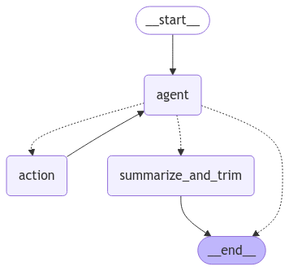

The agent workflow has three nodes, each Python module modifying the agent's state, a shared data structure. The edges between the nodes represent the allowed transitions between them, with solid lines unconditional and dashed lines conditional. Nodes do the work, and edges tell what to do next.

The ```__start__``` and ```__end__``` nodes inform the graph where to start and stop. The ```agent``` node runs the primary LLM, and if it decides to use a tool, the ```action``` node runs the tool and then returns control to the ```agent```. When the agent does not call a tool, control passes to ```summarize_and_remove_messages```, which summarizes only when trimming is required to manage the LLM context.

### LLM Context Management
You need to carefully manage the context length of LLMs to balance cost, accuracy, and latency and avoid triggering rate limits such as OpenAI's Tokens per Minute restriction. The system controls the context length of the primary model by trimming the messages in the context if they exceed a max parameter which can be expressed in either tokens or messages, and the trimmed messages are replaced by a shorter summary inserted into the system message. These parameters are configurable in the UI, with defaults defined in `const.py`; their description is below.

Parameter | Description | Default
-- | -- | -- |
`max_messages_in_context` | Messages to keep in context before deletion | 60
`max_tokens_in_context` | Tokens to keep in context before deletion | 32000
`manage_context_with_tokens` | If "true", use tokens to manage context, else use messages | "true"

### Latency
The latency between user requests or the agent taking timely action on the user's behalf is critical for you to consider in the design. I used several techniques to reduce latency, including using specialized, smaller helper LLMs running on the edge and facilitating primary model prompt caching by structuring the prompts to put static content, such as instructions and examples, upfront and variable content, such as user-specific information at the end. These techniques also reduce primary model usage costs considerably.

You can see the typical latency performance in the table below.

Action | Latency (s) | Remark
-- | -- | -- |
HA intents | < 1 | e.g., turn on a light
Analyze camera image | < 3 | initial request
Add automation | < 1 |
Memory operations | < 1 |

### Tools
The agent can use HA tools as specified in the [LLM API](https://developers.home-assistant.io/docs/core/llm/) and other tools built in the LangChain framework as defined in `tools.py`. Additionally, you can extend the LLM API with tools of your own as well. The code gives the primary LLM the list of tools it can call, along with instructions on using them in its system message and in the docstring of the tool's Python function definition. If the agent decides to use a tool, the LangGraph node `action` is entered, and the node's code runs the tool. The node uses a simple error recovery mechanism that will ask the agent to try calling the tool again with corrected parameters in the event of making a mistake.

The agent can call HA LLM API tools, including [built-in intents](https://developers.home-assistant.io/docs/intent_builtin) like `HassTurnOn` and `HassTurnOff`. The integration normalizes lock intents to lock/unlock services and routes alarm intents to the `alarm_control` tool.

You can see the list of LangChain tools that the agent can use in the table below.

Langchain Tool | Purpose
-- | -- |
`get_and_analyze_camera_image` | run scene analysis on the image from a camera
`upsert_memory` | add or update a memory
`add_automation` | create and register a HA automation (available when Schema-first YAML mode is disabled)
`write_yaml_file` | write YAML to `/config/www/` and return a `/local/...` URL
`confirm_sensitive_action` | confirm and execute a pending critical action with a PIN
`alarm_control` | arm or disarm an alarm control panel with the alarm code
`get_entity_history` | query HA database for entity history
`resolve_entity_ids` | resolve entity IDs from friendly names, areas, labels, and domains
<del>`get_current_device_state`</del> | <del>get the current state of one or more Home Assistant devices</del> (deprecated, using native HA GetLiveContext tool instead)

### Hardware
I built the HA installation on a Raspberry Pi 5 with SSD storage, Zigbee, and LAN connectivity. I deployed the edge models under Ollama on an Ubuntu-based server with an AMD 64-bit 3.4 GHz CPU, Nvidia 3090 GPU, and 64 GB system RAM. The server is on the same LAN as the Raspberry Pi.

## Example Use Cases
### Create an automation.
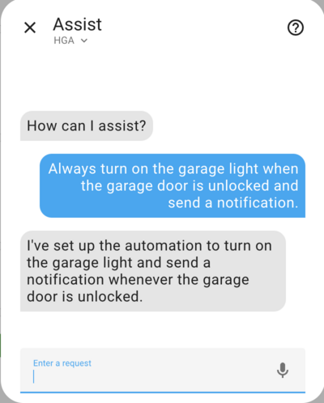

### Create an automation that runs periodically.
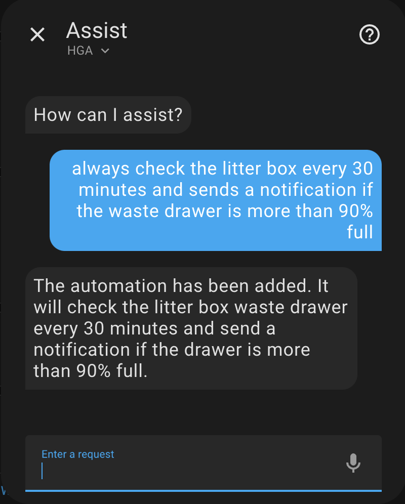

The snippet below shows that the agent is fluent in yaml based on what it generated and registered as an HA automation (this is disabled when Schema-first YAML mode is enabled).

```yaml
alias: Check Litter Box Waste Drawer
triggers:
  - minutes: /30
    trigger: time_pattern
conditions:
  - condition: numeric_state
    entity_id: sensor.litter_robot_4_waste_drawer
    above: 90
actions:
  - data:
      message: The Litter Box waste drawer is more than 90% full!
    action: notify.notify
```

### Check a single camera.
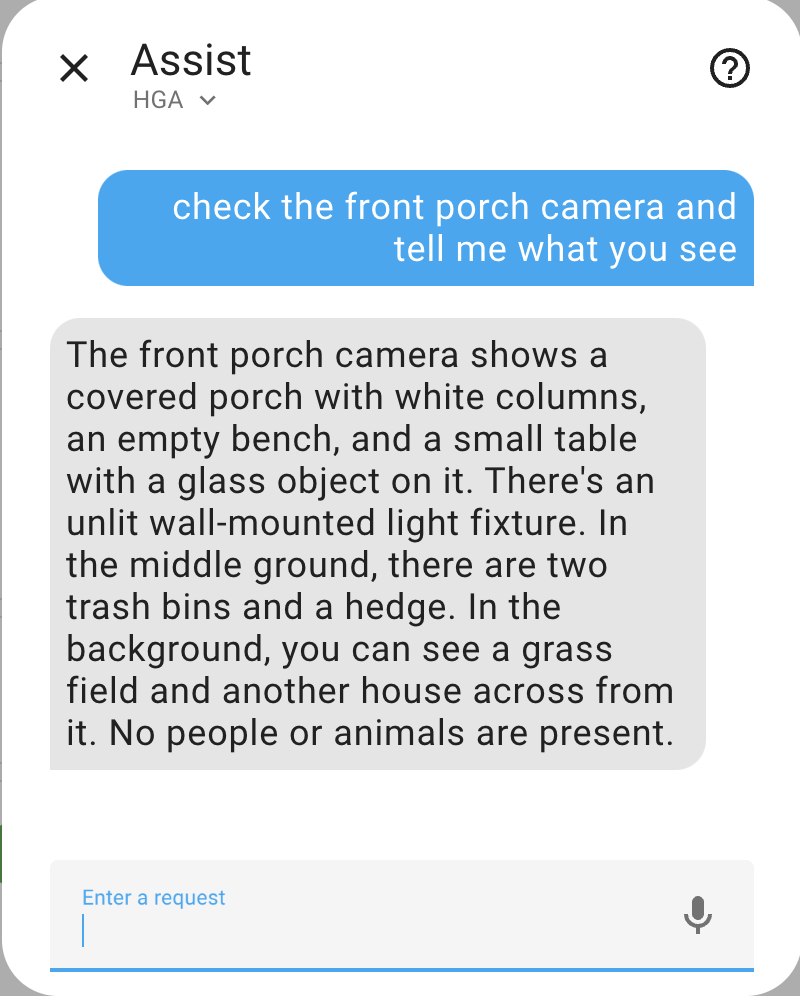

### Check multiple cameras.
https://github.com/user-attachments/assets/230baae5-8702-4375-a3f0-ffa981ee66a3

### Check the history of a light.
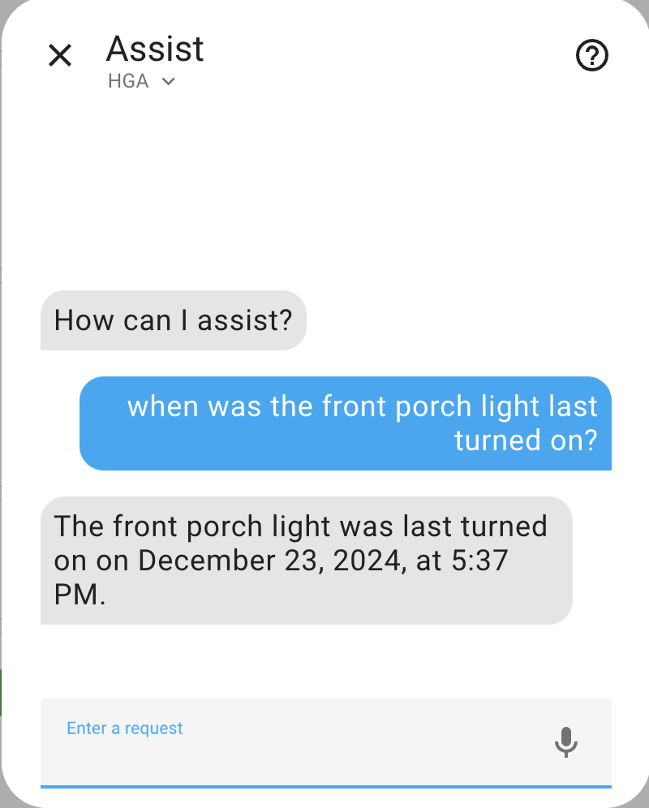

### Report the energy consumption of an appliance.
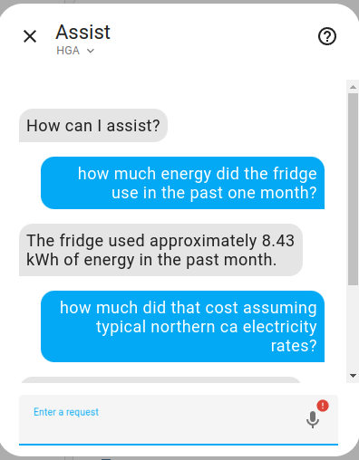 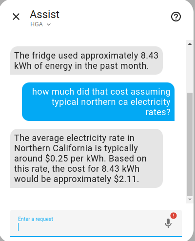

### Summarize home state.
https://github.com/user-attachments/assets/96f834a8-58cc-4bd9-a899-4604c1103a98

You can create an automation of the home state summary that runs periodically from the HA Blueprint `hga_summary.yaml` located in the `blueprints` folder.

### Long-term memory with semantic search.
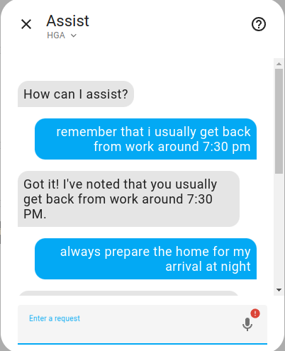
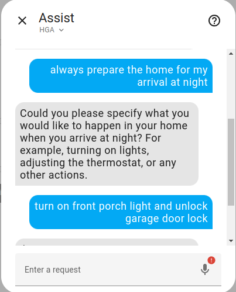
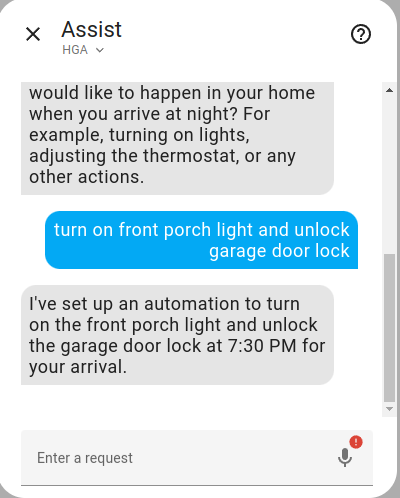

You can see that the agent correctly generates the automation below.
```yaml
alias: Prepare Home for Arrival
description: Turn on front porch light and unlock garage door lock at 7:30 PM
mode: single
triggers:
 - at: "19:30:00"
    trigger: time
actions:
  - target:
      entity_id: light.front_porch_light
    action: light.turn_on
    data: {}
  - target:
      entity_id: lock.garage_door_lock
    action: lock.unlock
    data: {}
```

### Check a camera for packages.
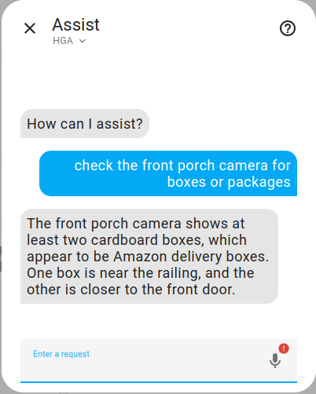

Below is the camera image the agent analyzed, you can see that two packages are visible. 

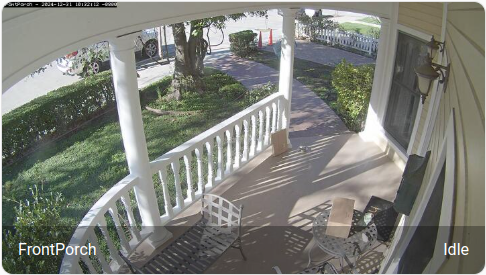

### Proactive notification of package delivery.
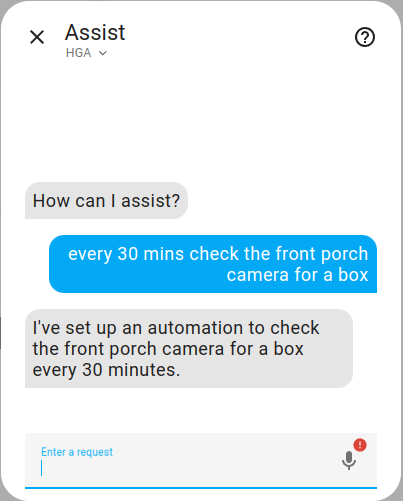

Below is an example notification from this automation if any boxes or packages are visible.

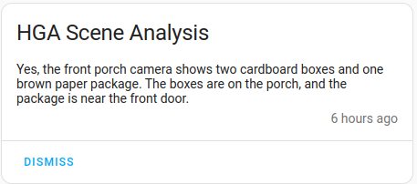

The agent uses a tool that in turn uses the HA Blueprint `hga_scene_analysis.yaml` for these requests and so the Blueprint needs to be installed in your HA installation.

### Proactive Camera Video Analysis.

You can enable proactive video scene analysis from cameras visible to Home Assistant. When enabled, motion detection will trigger the analysis which will be stored in a database for use by the agent, and optionally, notifications of the analysis will be sent to the mobile app. You can also enable anomaly detection which will only send notifications based on semantic search of the current analysis vis-a-vis the database. These options are set in the integration's config UI.

The image below is an example of a notification sent to the mobile app.

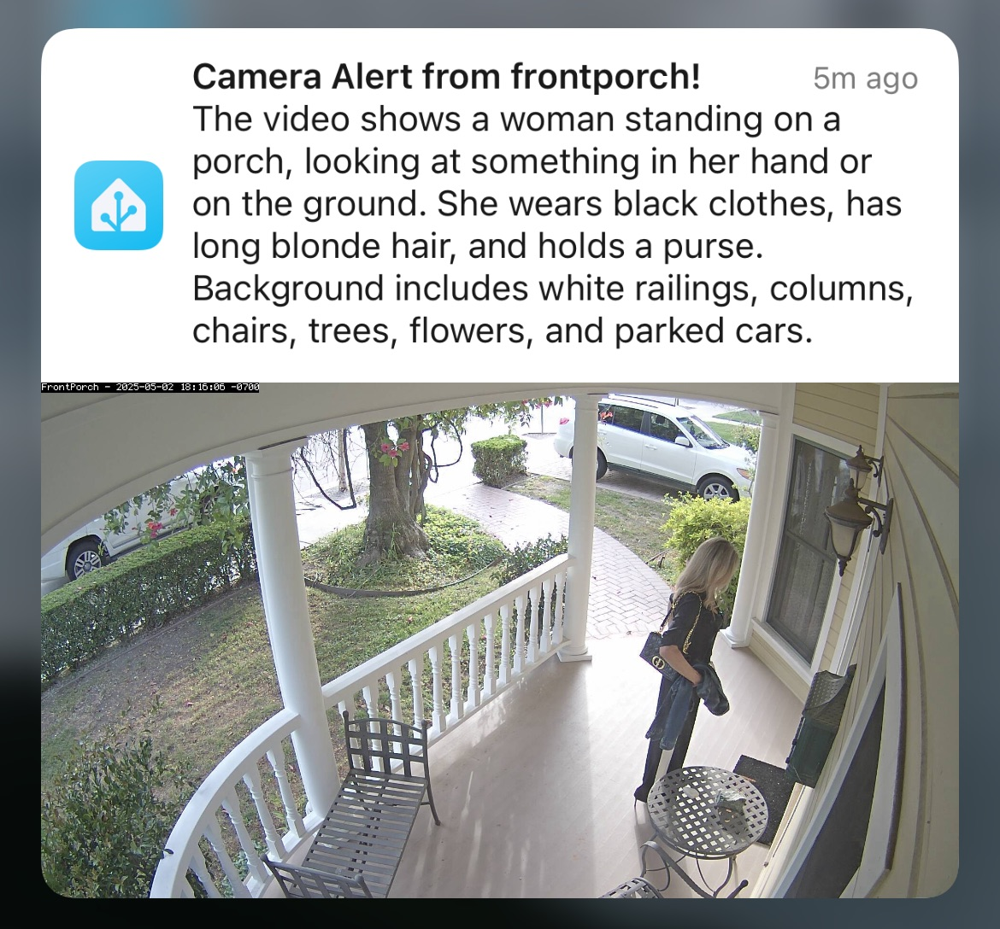

## Makefile

The Makefile provides a repeatable local dev workflow. It creates a `hga` venv using Python 3.14 and wires common tasks (deps, lint, tests, type checking).

Common commands:

```bash
make venv       # create venv with pip/setuptools/wheel
make devdeps    # install dev-only deps
make testdeps   # install test deps
make runtimedeps # regenerate + install runtime deps from manifest
```

Checks and formatting:

```bash
make lint       # regenerate runtime deps + ruff check (non-mutating)
make format     # ruff format (mutating)
make fix        # ruff --fix (mutating)
make typecheck  # pyright
```

Tests and cleanup:

```bash
make test       # pytest with runtime deps installed
make all        # devdeps + testdeps + runtimedeps + lint + test + check + typecheck
make clean      # remove the venv
```

Note: `make lint` will fail if `requirements_runtime_manifest.txt` is out of date. Run `make runtimedeps` or `make lint` to regenerate it.

## Contributions are welcome!

If you want to contribute to this, please read the [Contribution guidelines](CONTRIBUTING.md)

***

[home_generative_agent]: https://github.com/goruck/home-generative-agent
[commits-shield]: https://img.shields.io/github/commit-activity/y/goruck/home-generative-agent.svg?style=for-the-badge
[commits]: https://github.com/goruck/home-generative-agent/commits/main
[license-shield]: https://img.shields.io/github/license/goruck/home-generative-agent.svg?style=for-the-badge
[maintenance-shield]: https://img.shields.io/badge/maintainer-Lindo%20St%20Angel%20%40goruck-blue.svg?style=for-the-badge
[releases-shield]: https://img.shields.io/github/v/release/goruck/home-generative-agent.svg?style=for-the-badge
[releases]: https://github.com/goruck/home-generative-agent/releases
<!---->
