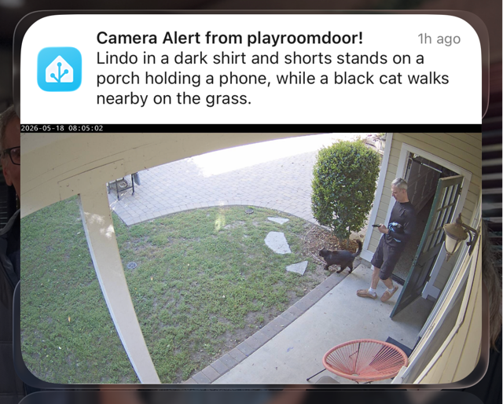
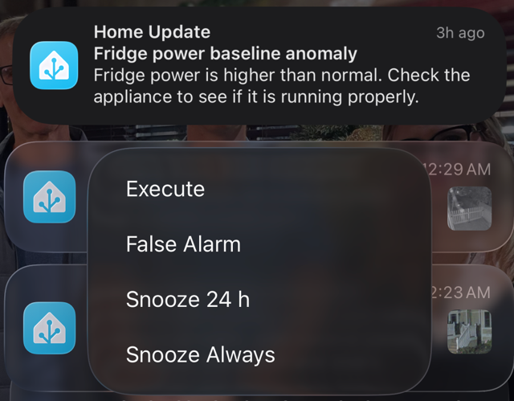

# home-generative-agent

[![GitHub Release][releases-shield]][releases]
[![GitHub Activity][commits-shield]][commits]
[![License][license-shield]](LICENSE)

![Project Maintenance][maintenance-shield]

A [Home Assistant](https://www.home-assistant.io/) integration that brings a generative AI agent into your smart home. Talk to your home, create automations in plain English, analyze camera footage, and get proactive alerts — all powered by your choice of cloud or local LLMs. HGA is a single integration that gives you conversational control over every HA entity, camera understanding with face recognition, long-term semantic memory, and the Sentinel anomaly engine.

## Features

| Feature | What it does |
| --- | --- |
| **Conversational control** | Talk to your home in natural language. Turn things on, check status, ask questions. |
| **Automation creation** | Describe what you want in chat and the agent writes and registers the HA automation. |
| **Camera & image analysis** | Ask the agent what it sees in any camera. Proactive motion-triggered analysis with anomaly detection. Works with Axis (VMD), Ring via ring-mqtt (including battery cameras via `event_select` — battery models need the `Interval` snapshot mode or a small [take-snapshot automation](docs/camera-entities.md#ring-cameras-via-ring-mqtt), because ring-mqtt's default `Auto` mode never refreshes their snapshots), Reolink, UniFi Protect, and any camera that exposes a `binary_sensor.*` motion entity or a `recording` state in HA. |
| **Sentinel anomaly detection** | Deterministic rules watch for security and safety issues (unlocked locks, open entries, unknown people) and alert your phone. Optional LLM-powered triage and rule discovery. Approved discovery rules can be inspected, deactivated, reactivated, and surgically repaired via HA services. |
| **Face recognition** | Identify people in camera frames and personalize alerts. |
| **Long-term memory** | Semantic search over past conversations. The agent remembers your preferences and context. |
| **Streaming responses** | First tokens appear word-by-word in the HA conversation UI — no waiting for the full response. |
| **Cloud and edge models** | Use OpenAI, Gemini, Anthropic, or run everything locally with Ollama or any OpenAI-compatible server. |

## Screenshots

### Conversational control and automation creation


### Camera analysis


### Long-term memory with semantic search


### Proactive camera notifications


### Real-time camera alert mobile device notifications



### Anomaly detection notification



## Requirements

| Requirement | Notes |
| --- | --- |
| Home Assistant | 2025.5.0 minimum; 2026.4.0+ for streaming responses |
| HACS | Required for the recommended install path; manual install is also supported |
| PostgreSQL with pgvector | Provided as a bundled HA app (step 1 below) |
| Model provider | At least one of: OpenAI, Gemini, Anthropic, Ollama, or any OpenAI-compatible server |
| Edge GPU server *(optional)* | Ollama, vLLM, llama.cpp, or LiteLLM for local model serving |
| face-service *(optional)* | An external service required only for face recognition in camera analysis |

## Quick Start

Get the basic conversational agent running in seven steps. See the [full installation guide](docs/installation.md) for optional apps (edge models, face recognition).

**1. Install the [PostgreSQL with pgvector](https://github.com/goruck/addon-postgres-pgvector/tree/main/postgres_pgvector) app.**

> **Requires Home Assistant OS or Supervised** (apps are not available on HA Container or Core).

Click the button below to add the repository, then install and configure the app per its [documentation](https://github.com/goruck/addon-postgres-pgvector/blob/main/postgres_pgvector/DOCS.md).

[](https://my.home-assistant.io/redirect/supervisor_add_addon_repository/?repository_url=https%3A%2F%2Fgithub.com%2Fgoruck%2Faddon-postgres-pgvector)

> If the button doesn't work, add the repository manually: **Settings → Apps → App Store → ⋮ → Repositories**, enter `https://github.com/goruck/addon-postgres-pgvector`, then search for and install `postgres_pgvector`.

**2. Install Home Generative Agent from HACS.**

[](https://my.home-assistant.io/redirect/hacs_repository/?owner=goruck&repository=https%3A%2F%2Fgithub.com%2Fgoruck%2Fhome-generative-agent&category=integration)

**3. Restart Home Assistant.**

**4. Add the integration:** Settings → Devices & Services → Add Integration → search **Home Generative Agent** → complete the initial instruction screen.

**5. Add a Model Provider:** on the integration page click **+ Model Provider** and configure OpenAI, Ollama, Gemini, Anthropic, or any OpenAI-compatible endpoint. A provider must exist before you can run Setup.

**6. Open the integration page and click + Setup.** Choose a setup mode:
   - **Basic** — enables all features with recommended defaults and creates the database subentry automatically. No database prompt appears.
   - **Advanced** — configure each feature individually; includes a database configuration step.

**7. Set as your voice assistant:** Settings → Voice Assistants → select **Home Generative Agent** as the conversation agent.

You can now open the HA Assist panel and start talking to your home.

## Documentation

| Guide | Contents |
| --- | --- |
| [Installation](docs/installation.md) | HACS install, manual install, optional apps (Ollama, face recognition) |
| [Configuration](docs/configuration.md) | Model providers, features, Tool Retrieval (RAG), LLM API, STT, YAML mode, Critical Action PIN, camera description language & extra VLM instructions, UI languages (en/cs/ru/tr) |
| [Sentinel](docs/sentinel.md) | Anomaly detection pipeline, built-in rules, triage, baseline, blueprints, notification quiet hours, services API, health sensor |
| [Camera Entities](docs/camera-entities.md) | Image and sensor entities, dashboards, automations, proactive video analysis, face recognition |
| [Architecture](docs/architecture.md) | LangGraph agent, model tiers, context management, streaming, latency, tools |
| [Contributing](docs/contributing.md) | Dev setup, Makefile reference, dependency workflow, translations |

## More Examples

### Automation that runs on a schedule

*User asked: "Remind me every 30 minutes if the litter box waste drawer is over 90% full." Agent wrote and registered the automation.*

```yaml
alias: Check Litter Box Waste Drawer
triggers:
  - minutes: /30
    trigger: time_pattern
conditions:
  - condition: numeric_state
    entity_id: sensor.litter_robot_4_waste_drawer
    above: 90
actions:
  - data:
      message: The Litter Box waste drawer is more than 90% full!
    action: notify.notify
```


### Query entity history

*User asked: "When did the front porch light turn on today?" Agent queried the HA history database and summarized the results.*


### Energy consumption report

*User asked: "How much energy did the fridge use today?" Agent pulled sensor history and gave a plain-English summary.*


### Semantic memory across conversations

*User asked in a later conversation: "always prepare the home for my arrival at night" Agent retrieved the relevant context from long-term memory and then built the automation, remembering that the user arrives home around 7:30 PM.*

 

### Check a camera for packages

*User asked: "Are there any packages at the front gate?" Agent analyzed the live camera and confirmed two boxes visible.*


## Contributions are welcome

If you want to contribute to this, please read the [Contribution guidelines](CONTRIBUTING.md).

***

[commits-shield]: https://img.shields.io/github/commit-activity/y/goruck/home-generative-agent.svg?style=for-the-badge
[commits]: https://github.com/goruck/home-generative-agent/commits/main
[license-shield]: https://img.shields.io/github/license/goruck/home-generative-agent.svg?style=for-the-badge
[maintenance-shield]: https://img.shields.io/badge/maintainer-Lindo%20St%20Angel%20%40goruck-blue.svg?style=for-the-badge
[releases-shield]: https://img.shields.io/github/v/release/goruck/home-generative-agent.svg?style=for-the-badge
[releases]: https://github.com/goruck/home-generative-agent/releases
