# Home Generative Agent

**Talk to your home.**

[![GitHub Release][releases-shield]][releases]
[![HACS][hacs-shield]][hacs]
[![GitHub Stars][stars-shield]][stars]
[![GitHub Activity][commits-shield]][commits]
[![License][license-shield]](LICENSE)

![Project Maintenance][maintenance-shield]

A [Home Assistant](https://www.home-assistant.io/) integration that brings a generative AI agent into your smart home. Talk to your home, create automations in plain English, analyze camera footage, and get proactive alerts — all powered by your choice of cloud or local LLMs. HGA is a single integration that gives you conversational control over every HA entity, camera understanding with face recognition, long-term semantic memory, and the Sentinel anomaly engine.

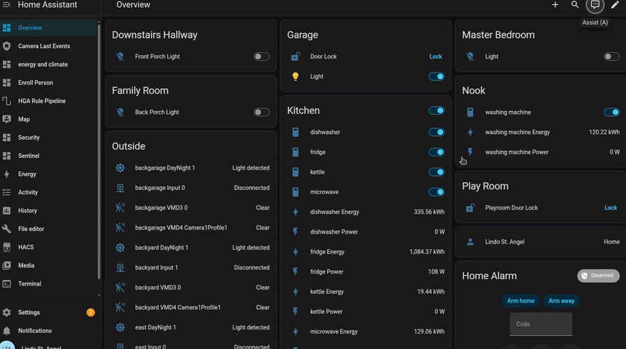

*Creating an automation in plain English — the agent writes the YAML, registers it, and it shows up in the HA automation editor.*

## Why HGA?

Most AI conversation integrations are prompt passthroughs: they forward your words to an LLM and read back the answer. HGA is a full agent built on LangGraph — it uses tools to control entities, query history, watch cameras, and write real HA automations; it keeps long-term semantic memory in pgvector so it remembers your preferences across conversations; and its Sentinel anomaly engine keeps safety decisions deterministic, with the LLM advising but never actuating. Everything runs against the model provider you choose — including fully local, so no data has to leave your home.

## Features

| Feature | What it does |
| --- | --- |
| **Conversational control** | Talk to your home in natural language. Turn things on, check status, ask questions. |
| **Automation creation** | Describe what you want in chat and the agent writes and registers the HA automation. With the [Critical Action PIN](docs/configuration.md#critical-action-pin) enabled, an automation that would unlock a door or open a garage is held for PIN confirmation before it is installed — same as the direct command. |
| **Camera & image analysis** | Ask the agent what it sees in any camera. Proactive motion-triggered analysis with anomaly detection. Works with Axis, Ring via ring-mqtt, Reolink, UniFi Protect, and any camera that exposes a motion entity or `recording` state in HA — see [Camera Entities](docs/camera-entities.md) for setup notes (battery Ring cameras need a [snapshot-mode tweak](docs/camera-entities.md#ring-cameras-via-ring-mqtt)). |
| **Sentinel anomaly detection** | Deterministic rules watch for security and safety issues (unlocked locks, open entries, unknown people) and alert your phone. Optional LLM-powered triage and rule discovery — covering power, battery, and environmental sensors (temperature, humidity, CO₂, air quality, …). Approved discovery rules can be inspected, deactivated, reactivated, and surgically repaired via HA services. |
| **Face recognition** | Identify people in camera frames and personalize alerts. |
| **Long-term memory** | Semantic search over past conversations. The agent remembers your preferences and context. |
| **Streaming responses** | First tokens appear word-by-word in the HA conversation UI — no waiting for the full response. |
| **Cloud and edge models** | Use OpenAI, Gemini, Anthropic, or run everything locally with Ollama or any OpenAI-compatible server. |

## Screenshots

### Camera analysis

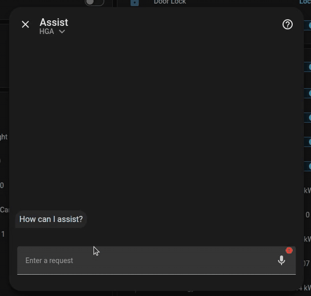

### Long-term memory with semantic search

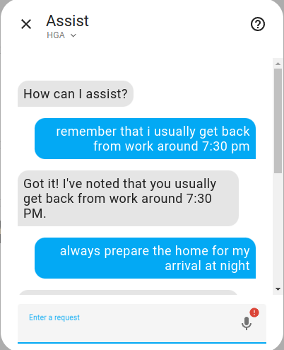

### Proactive camera notifications

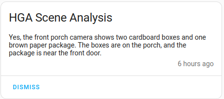

### Real-time camera alert mobile device notifications

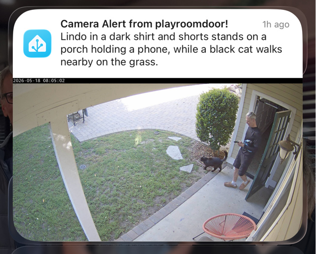

### Anomaly detection notification

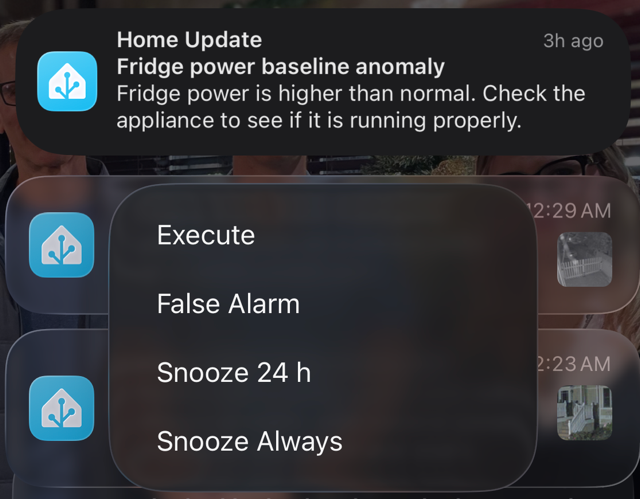

## Requirements

| Requirement | Notes |
| --- | --- |
| Home Assistant | 2025.5.0 minimum; 2026.4.0+ for streaming responses |
| HACS | Required for the recommended install path; manual install is also supported |
| PostgreSQL with pgvector | Provided as a bundled HA app (step 1 below) |
| Model provider | At least one of: OpenAI, Gemini, Anthropic, Ollama, or any OpenAI-compatible server |
| Edge GPU server *(optional)* | Ollama, vLLM, llama.cpp, or LiteLLM for local model serving |
| face-service *(optional)* | An external service required only for face recognition in camera analysis |

## Quick Start

Get the basic conversational agent running in seven steps. See the [full installation guide](docs/installation.md) for optional apps (edge models, face recognition).

**1. Install the [PostgreSQL with pgvector](https://github.com/goruck/addon-postgres-pgvector/tree/main/postgres_pgvector) app.**

> **Requires Home Assistant OS or Supervised** (apps are not available on HA Container or Core).

Click the button below to add the repository, then install and configure the app per its [documentation](https://github.com/goruck/addon-postgres-pgvector/blob/main/postgres_pgvector/DOCS.md).

[](https://my.home-assistant.io/redirect/supervisor_add_addon_repository/?repository_url=https%3A%2F%2Fgithub.com%2Fgoruck%2Faddon-postgres-pgvector)

> If the button doesn't work, add the repository manually: **Settings → Apps → App Store → ⋮ → Repositories**, enter `https://github.com/goruck/addon-postgres-pgvector`, then search for and install `postgres_pgvector`.

**2. Install Home Generative Agent from HACS.**

[](https://my.home-assistant.io/redirect/hacs_repository/?owner=goruck&repository=https%3A%2F%2Fgithub.com%2Fgoruck%2Fhome-generative-agent&category=integration)

**3. Restart Home Assistant.**

**4. Add the integration:** Settings → Devices & Services → Add Integration → search **Home Generative Agent** → complete the initial instruction screen.

**5. Add a Model Provider:** on the integration page click **+ Model Provider** and configure OpenAI, Ollama, Gemini, Anthropic, or any OpenAI-compatible endpoint. A provider must exist before you can run Setup.

**6. Open the integration page and click + Setup.** Choose a setup mode:
   - **Basic** — enables all features with recommended defaults and creates the database subentry automatically. No database prompt appears.
   - **Advanced** — configure each feature individually; includes a database configuration step.

**7. Set as your voice assistant:** Settings → Voice Assistants → select **Home Generative Agent** as the conversation agent.

You can now open the HA Assist panel and start talking to your home.

## Documentation

| Guide | Contents |
| --- | --- |
| [Installation](docs/installation.md) | HACS install, manual install, optional apps (Ollama, face recognition) |
| [Configuration](docs/configuration.md) | Model providers, features, Tool Retrieval (RAG), LLM API, STT, YAML mode, Critical Action PIN, camera description language & extra VLM instructions, UI languages (en/cs/ru/tr) |
| [Sentinel](docs/sentinel.md) | Anomaly detection pipeline, built-in rules, triage, baseline, blueprints, notification quiet hours, services API, health sensor |
| [Camera Entities](docs/camera-entities.md) | Image and sensor entities, dashboards, automations, proactive video analysis, face recognition |
| [Architecture](docs/architecture.md) | LangGraph agent, model tiers, context management, streaming, latency, tools |
| [Contributing](docs/contributing.md) | Dev setup, Makefile reference, dependency workflow, translations |

## More Examples

### Automation that runs on a schedule

*User asked: "Remind me every 30 minutes if the litter box waste drawer is over 90% full." Agent wrote and registered the automation.*

```yaml
alias: Check Litter Box Waste Drawer
triggers:
  - minutes: /30
    trigger: time_pattern
conditions:
  - condition: numeric_state
    entity_id: sensor.litter_robot_4_waste_drawer
    above: 90
actions:
  - data:
      message: The Litter Box waste drawer is more than 90% full!
    action: notify.notify
```

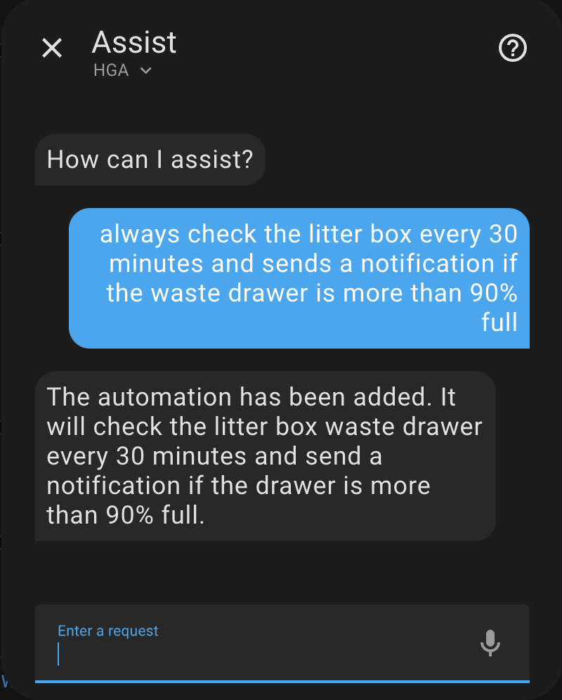

### Query entity history

*User asked: "When did the front porch light turn on today?" Agent queried the HA history database and summarized the results.*
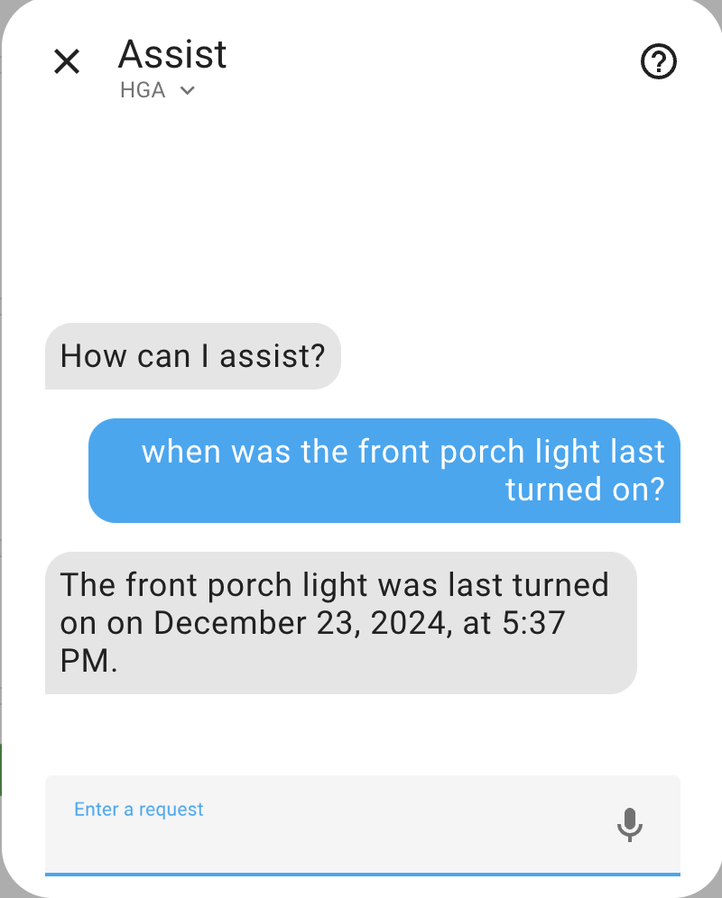

### Energy consumption report

*User asked: "How much energy did the fridge use today?" Agent pulled sensor history and gave a plain-English summary.*
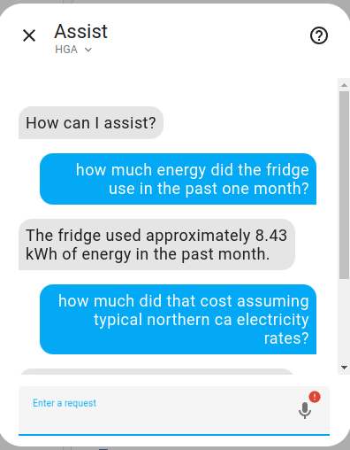

### Semantic memory across conversations

*User asked in a later conversation: "always prepare the home for my arrival at night" Agent retrieved the relevant context from long-term memory and then built the automation, remembering that the user arrives home around 7:30 PM.*

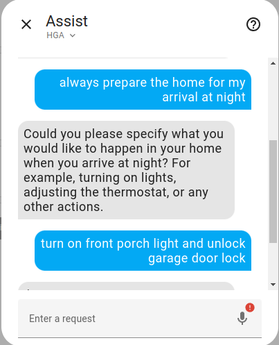 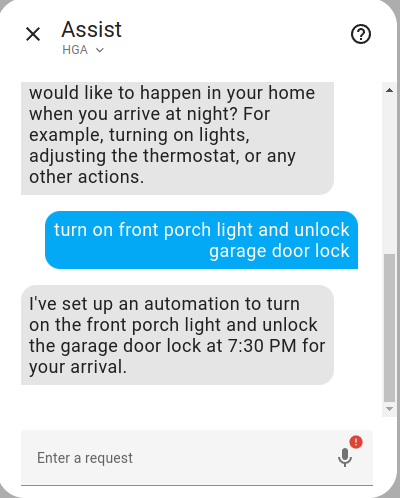

### Check a camera for packages

*User asked: "Are there any packages at the front gate?" Agent analyzed the live camera and confirmed two boxes visible.*
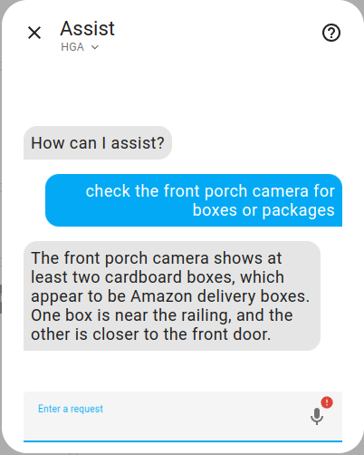

## Community Dashboards

Dashboard recipes shared by users. Have one of your own? Post it in [Discussions](https://github.com/goruck/home-generative-agent/discussions) and it may get featured here.

The recipes below were shared by [@hruba202](https://github.com/hruba202) in [discussion #513](https://github.com/goruck/home-generative-agent/discussions/513) and [issue #538](https://github.com/goruck/home-generative-agent/issues/538). The first two use the excellent [flex-table-card](https://github.com/custom-cards/flex-table-card) (the second also has a compact [entity-attributes-card](https://github.com/custom-cards/entity-attributes-card) variant); the third combines [vertical-stack-in-card](https://github.com/ofekashery/vertical-stack-in-card), entity-attributes-card, and [card-mod](https://github.com/thomasloven/lovelace-card-mod) (all installable from HACS). Replace the example entity IDs with your own; the column names and labels are in Czech from the original install — rename them to taste. The `grid_options` sizing in the flex-table recipes assumes the newer sections dashboard layout with wide sections — trim the `columns:` values to fit your grid (standard sections are 12 columns wide; the older masonry layout ignores `grid_options` entirely).

### Recognized people across cameras

One row per camera, pulling the `recognized_people` sensor attributes into columns.

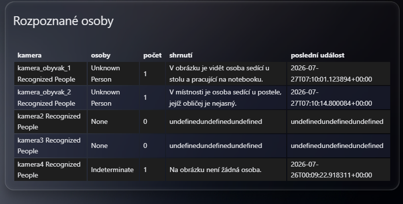

```yaml
type: custom:flex-table-card
title: Rozpoznané osoby
entities:
  include:
    - sensor.kamera_obyvak_1_recognized_people
    - sensor.kamera_obyvak_2_recognized_people
    - sensor.kamera2_recognized_people
    - sensor.kamera3_recognized_people
    - sensor.kamera4_recognized_people
columns:
  - data: name
    name: kamera
  - data: state
    name: osoby
  - data: count
    name: počet
  - data: summary
    name: shrnutí
  - data: last_event
    name: poslední událost
grid_options:
  columns: 30
```

> **Tip:** cameras with no events yet report `null` for `summary` and `last_event` — older flex-table-card releases render that as the `undefined` text visible in the screenshot above; current releases show `n/a`. To substitute your own placeholder, use the column's `modify` option. Two gotchas: quote the expression (its colon otherwise breaks YAML parsing), and current card versions hand `modify` an empty array for missing values, so a plain `x == null` check isn't enough:
>
> ```yaml
>   - data: summary
>     name: shrnutí
>     modify: "Array.isArray(x) || x == null ? '—' : x"
> ```

### Sentinel health at a glance

A two-row grid over the [Sentinel health sensor](docs/sentinel.md#health-sensor), spreading its KPI attributes across columns.

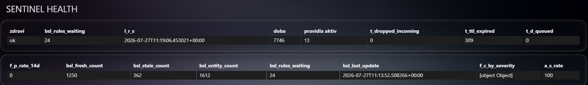

```yaml
square: false
type: grid
cards:
  - type: custom:flex-table-card
    entities:
      include:
        - sensor.sentinel_health
    columns:
      - data: state
        name: zdraví
      - data: baseline_rules_waiting
        name: bsl_rules_waiting
      - data: last_run_start
        name: l_r_s
      - data: run_duration_ms
        name: doba
      - data: active_rule_count
        name: pravidla aktiv
      - data: triggers_dropped_incoming
        name: t_dropped_incoming
      - data: triggers_ttl_expired
        name: t_ttl_expired
      - data: triggers_dropped_queued
        name: t_d_queued
    grid_options:
      columns: 5
      rows: 1
  - type: custom:flex-table-card
    entities:
      include:
        - sensor.sentinel_health
    columns:
      - data: false_positive_rate_14d
        name: f_p_rate_14d
      - data: baseline_fresh_count
        name: bsl_fresh_count
      - data: baseline_stale_count
        name: bsl_stale_count
      - data: baseline_entity_count
        name: bsl_entity_count
      - data: baseline_rules_waiting
        name: bsl_rules_waiting
      - data: baseline_last_update
        name: bsl_last_update
      - data: findings_count_by_severity
        name: f_c_by_severity
      - data: action_success_rate
        name: a_s_rate
    grid_options:
      columns: 5
      rows: 1
grid_options:
  columns: full
  rows: 3
title: SENTINEL HEALTH
columns: 1
```

> **Tip:** `findings_count_by_severity` is a dictionary attribute (keys `low`/`medium`/`high`), so it renders as `[object Object]` by default. Use the column's `modify` option (same two gotchas as above) to pull out one severity per column, `modify: "Array.isArray(x) || x == null ? '—' : (x.high ?? 0)"`, or render the whole dictionary compactly with `modify: "Array.isArray(x) || x == null ? '—' : JSON.stringify(x)"`.

#### Compact variant

A tighter single-card alternative (shared in [issue #538](https://github.com/goruck/home-generative-agent/issues/538)) that lists a hand-picked subset of the health sensor's attributes — plus `triggers_excluded`, which the flex-table grid above doesn't show — as label/value rows via `entity-attributes-card`:

```yaml
type: custom:entity-attributes-card
heading_name: Sentinel
heading_state: ok
filter:
  include:
    - key: sensor.sentinel_health.triggers_excluded
      name: vyloučená spuštění
    - key: sensor.sentinel_health.baseline_rules_waiting
      name: čekajici pr.
    - key: sensor.sentinel_health.last_run_start
      name: poslední běh
    - key: sensor.sentinel_health.run_duration_ms
      name: doba běhu
    - key: sensor.sentinel_health.active_rule_count
      name: aktivní pravidla
    - key: sensor.sentinel_health.triggers_dropped_incoming
      name: zahozené příchozí t.
    - key: sensor.sentinel_health.triggers_ttl_expired
      name: triggers_ttl_expired
    - key: sensor.sentinel_health.triggers_dropped_queued
      name: zahazované/zařazené tr.
```

> **Tip:** `heading_name` and `heading_state` are static column-header text, not live entity state — the `ok` above stays "ok" even when the health sensor reports `degraded`. `entity-attributes-card` renders attributes only; to show the actual sensor state, keep the flex-table variant's `data: state` column or pair this card with an `entities` row for `sensor.sentinel_health`, as in the per-camera recipe below. Two more quirks: the three `triggers_*` scheduler rows only exist after the first Sentinel run completes, so a fresh install shows five rows until then — warm-up, not dead keys. And the card renders values raw: `last_run_start` appears as a full ISO-8601 timestamp and not-yet-populated attributes as the literal text `None` (the original post's `autoformat: true` is not an `entity-attributes-card` option and is omitted here).

### Per-camera event card

A single-camera card stacking the recognized-people sensor, the last-event image, and the sensor's attributes, with `card_mod` styling on top.

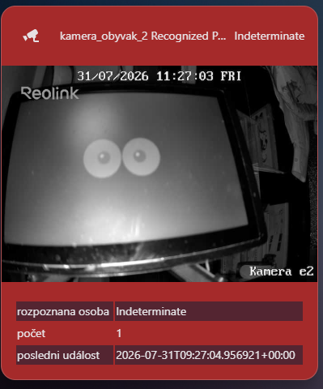

```yaml
type: custom:vertical-stack-in-card
cards:
  - type: entities
    entities:
      - entity: sensor.kamera_obyvak_2_recognized_people
    show_header_toggle: false
    state_color: true
  - type: picture-entity
    entity: image.kamera_obyvak_2_last_event
    show_name: false
    show_state: false
    tap_action:
      action: none
    hold_action:
      action: none
  - type: custom:entity-attributes-card
    heading_name: []
    heading_state: []
    filter:
      include:
        - key: sensor.kamera_obyvak_2_recognized_people.recognized_people
          name: rozpoznana osoba
        - key: sensor.kamera_obyvak_2_recognized_people.count
          name: počet
        - key: sensor.kamera_obyvak_2_recognized_people.last_event
          name: posledni událost
        - key: sensor.kamera_obyvak_2_recognized_people.summary
          name: shrnutí
card_mod:
  prepend: true
  style: |
    ha-card {
      background: brown;
      --ha-card-background: maroon;
      color: var(--primary-color);
    }
    :host {
      --card-mod-icon: mdi:cctv;
    }
```

> **Tip:** the recognized-people sensor exposes exactly six attributes: `recognized_people`, `count`, `summary`, `last_event`, `latest_path`, and `camera_id`. `entity-attributes-card` silently omits any row whose key doesn't exist, so misspelled keys just disappear from the card. (The version above corrects three rows from the original post accordingly — see the discussion thread. The screenshot predates the correction, so your card will show one more row than pictured: the summary.)

## Contributions are welcome

If you want to contribute to this, please read the [Contribution guidelines](CONTRIBUTING.md).

***

[commits-shield]: https://img.shields.io/github/commit-activity/y/goruck/home-generative-agent.svg?style=for-the-badge
[hacs-shield]: https://img.shields.io/badge/HACS-Default-41BDF5.svg?style=for-the-badge
[hacs]: https://github.com/hacs/integration
[stars-shield]: https://img.shields.io/github/stars/goruck/home-generative-agent.svg?style=for-the-badge
[stars]: https://github.com/goruck/home-generative-agent/stargazers
[commits]: https://github.com/goruck/home-generative-agent/commits/main
[license-shield]: https://img.shields.io/github/license/goruck/home-generative-agent.svg?style=for-the-badge
[maintenance-shield]: https://img.shields.io/badge/maintainer-Lindo%20St%20Angel%20%40goruck-blue.svg?style=for-the-badge
[releases-shield]: https://img.shields.io/github/v/release/goruck/home-generative-agent.svg?style=for-the-badge
[releases]: https://github.com/goruck/home-generative-agent/releases
